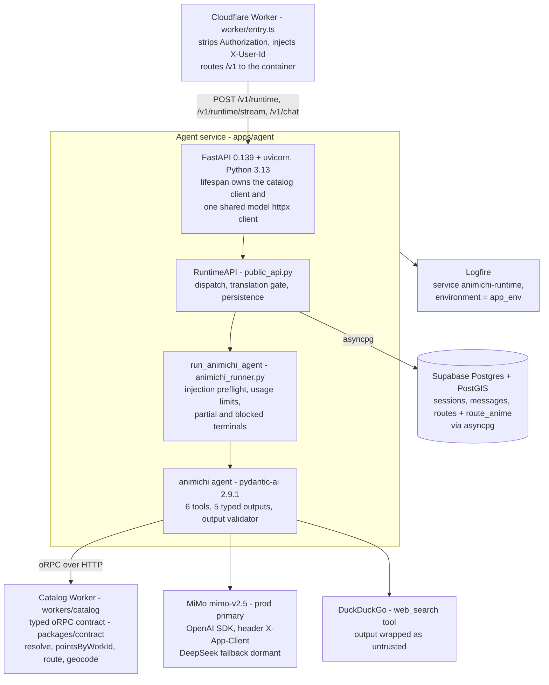
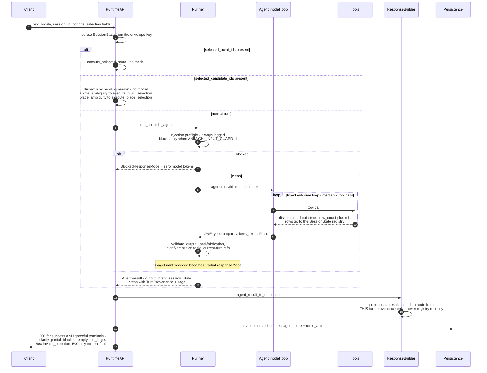
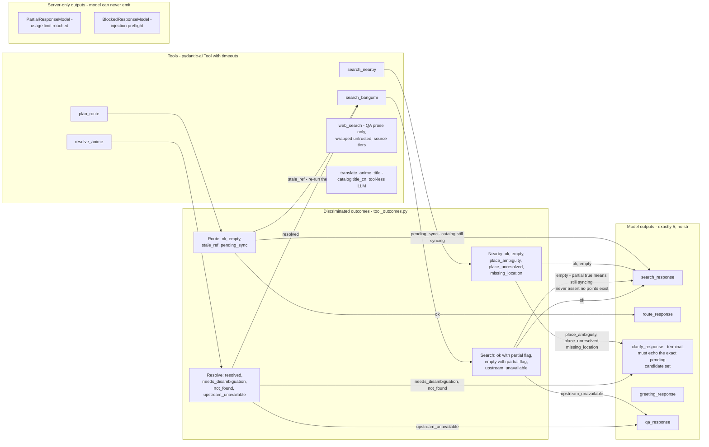
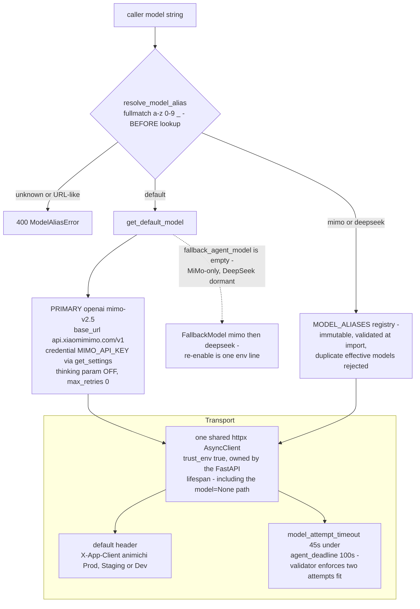
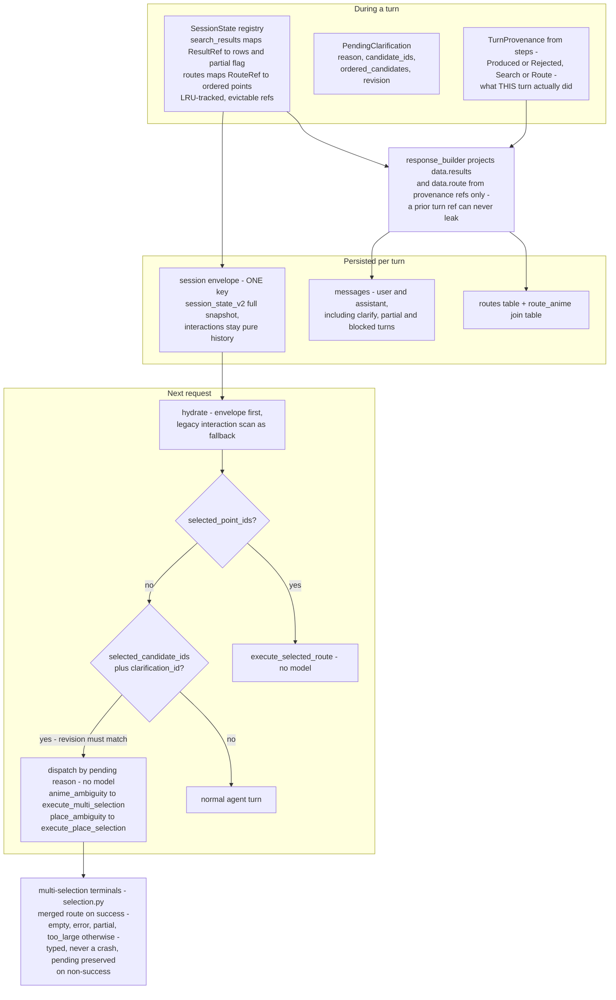

# Agent Architecture Diagrams

Visual companion to [ARCHITECTURE.md](./ARCHITECTURE.md), scoped to the **agent
service** (`apps/agent`), drawn against the post-redesign state of PR #349.
Every edge and label below is verified against the code at HEAD.

- [1. The agent and its direct dependencies](#1-the-agent-and-its-direct-dependencies)
- [2. One turn end to end](#2-one-turn-end-to-end)
- [3. The typed tool-outcome contract](#3-the-typed-tool-outcome-contract)
- [4. Model layer](#4-model-layer)
- [5. Session state and multi-turn selection](#5-session-state-and-multi-turn-selection)

---

## 1. The agent and its direct dependencies

The agent is a FastAPI app in a Cloudflare Container. Auth lives at the edge
Worker; the container trusts the forwarded `X-User-Id`.

Endpoints (`interfaces/routes/`): `POST /v1/runtime` (JSON), `POST
/v1/runtime/stream` (SSE step events), `POST /v1/chat` (Vercel AI protocol
adapter over the same RuntimeAPI), plus read-only conversations/routes/bangumi
routes and `/healthz`.

---

## 2. One turn end to end

Dispatch order and the graceful terminals, exactly as `public_api.py` and
`animichi_runner.py` implement them.

---

## 3. The typed tool-outcome contract

The thrash fix: tools return **discriminated outcomes** computed in the data
layer; the model only branches on them. The routing edges below quote the
agent's actual instruction table (`animichi_agent.py`, `_INSTRUCTIONS`).
`str` is not in the output union, so a run cannot end in prose.

The validator enforces the contract from the other side: a `search_response`
or `route_response` is rejected unless THIS turn recorded a matching Produced
step; a `clarify_response` must match the pending reason and candidate ids
exactly. `route empty` has no instructed output route - the validator simply
refuses a `route_response` for it.

---

## 4. Model layer

Verified values from `config/settings.py`, `config/model_aliases.py`,
`agents/base.py`.

Credential routing is one policy: `xiaomimimo.com` uses `MIMO_API_KEY`,
`deepseek.com` uses `DEEPSEEK_API_KEY`, anything else uses
`OPENAI_COMPAT_API_KEY` - all read through `get_settings()`.
`validate_required_env` hard-fails at startup on whatever the resolved
default and fallback actually need.

---

## 5. Session state and multi-turn selection

Multi-selection semantics (`selection.py`): fetch all selected works in
parallel, merge and dedupe by point id in selection order; any partial source
short-circuits to a `partial` terminal **before** the route call (preview
point ids are never routed); over 500 points or over 50 clusters returns
`too_large` without calling the route endpoint; all-empty keeps the pending
clarification so the user can pick again.
