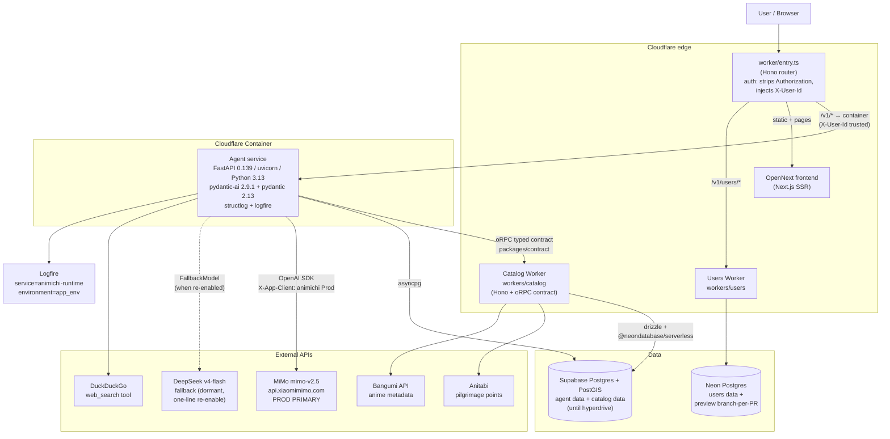
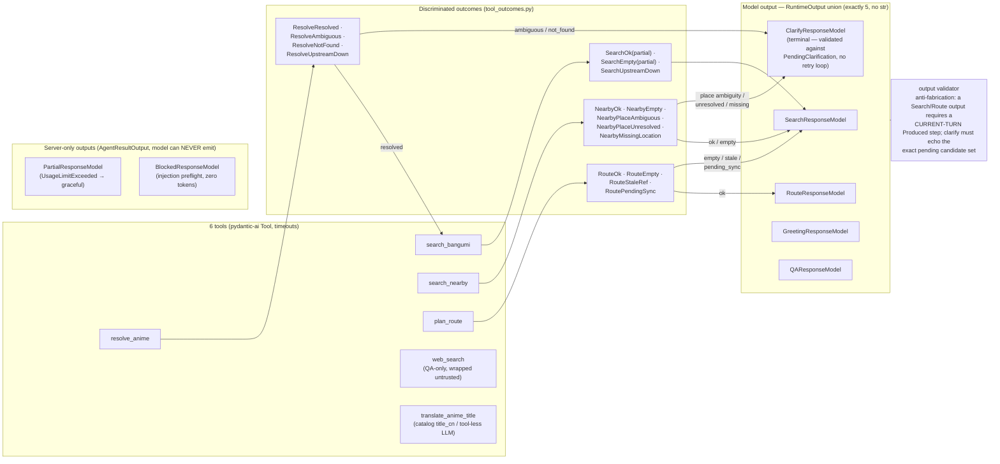
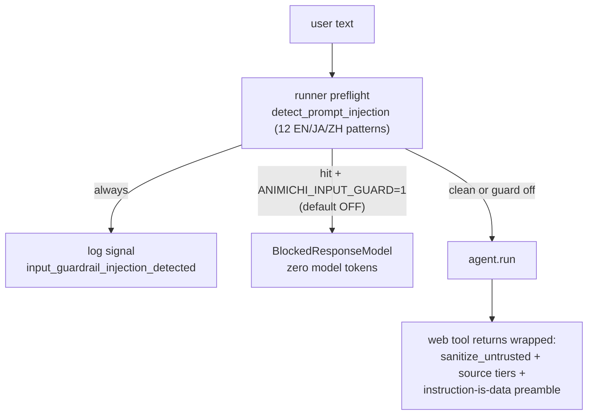
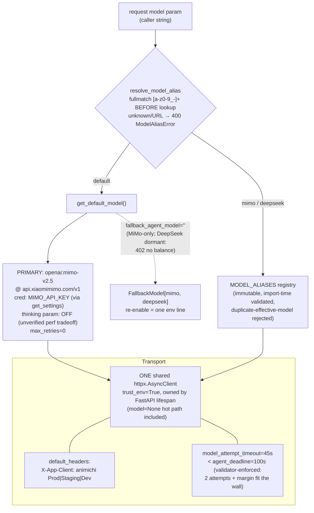
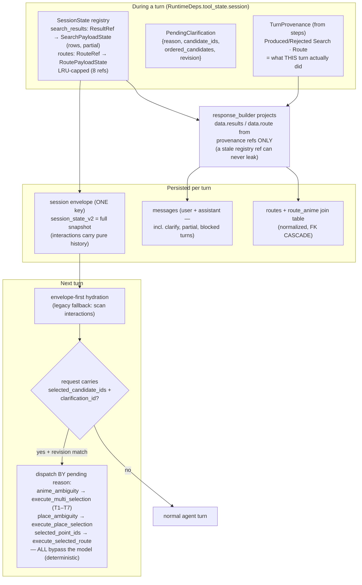
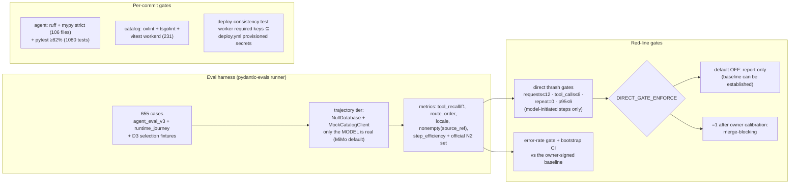

# Architecture Diagrams

Visual companion to [ARCHITECTURE.md](./ARCHITECTURE.md), drawn against the post-redesign
state of PR #349 (typed-outcome contract, MiMo-only prod model, demand-driven ingest).
Each diagram lists the concrete technology used by every part.

- [1. System topology](#1-system-topology-deployment-view)
- [2. Request lifecycle](#2-request-lifecycle-post-v1runtime)
- [3. The typed tool/outcome contract](#3-the-typed-tooloutcome-contract-the-thrash-fix)
- [4. Model layer](#4-model-layer-aliases-credentials-failover)
- [5. Session state & persistence](#5-session-state--persistence-multi-turn)
- [6. Catalog tiered read + demand-driven ingest](#6-catalog-tiered-read--demand-driven-ingest)
- [7. Eval & quality gates](#7-eval--quality-gates)

---

## 1. System topology (deployment view)

Everything enters through one Cloudflare Worker; the agent is a FastAPI app in a
Cloudflare Container; data services are split per service.



Key facts: the container trusts `X-User-Id` because the edge Worker owns auth;
`CONTAINER_REQUIRED_KEYS = [DEEPSEEK_API_KEY, MIMO_API_KEY, SUPABASE_DB_URL]` and a
deploy-consistency unit test asserts every required key is forwarded **and**
provisioned by `deploy.yml`.

---

## 2. Request lifecycle (`POST /v1/runtime`)

The happy path of one agent turn, including the guardrail preflight and the
graceful terminals.

```mermaid
sequenceDiagram
    autonumber
    participant C as Client
    participant W as CF Worker (Hono)
    participant API as RuntimeAPI<br/>(public_api.py)
    participant R as run_animichi_agent<br/>(animichi_runner.py)
    participant A as animichi agent<br/>(pydantic-ai, MiMo)
    participant T as Tools<br/>(catalog_tools / web_tools)
    participant CW as Catalog Worker
    participant RB as response_builder
    participant P as persistence

    C->>W: POST /v1/runtime {text, locale, session_id}
    W->>API: + X-User-Id (Authorization stripped)
    API->>API: restore SessionState (envelope session_state_v2)
    API->>R: dispatch (selection requests bypass the agent entirely)
    R->>R: injection PREFLIGHT: detect_prompt_injection(text)<br/>always logged; blocks (zero tokens) only if ANIMICHI_INPUT_GUARD=1
    R->>A: agent.run(trusted context + text)<br/>usage_limits, model_settings
    loop typed-outcome loop (median 2 tool calls)
        A->>T: tool call (resolve_anime / search_bangumi / ...)
        T->>CW: oRPC (resolve / pointsByWorkId / route / geocode)
        CW-->>T: rows / candidates / route
        T-->>A: DISCRIMINATED OUTCOME (never raw rows —<br/>row_count + result_ref; rows go to SessionState registry)
    end
    A-->>R: ONE typed output (allows_text=False —<br/>plain prose is impossible)
    R->>R: validate_output: anti-fabrication +<br/>clarify transition table + current-turn provenance
    Note over R: UsageLimitExceeded → PartialResponseModel (server-only)<br/>blocked preflight → BlockedResponseModel (server-only)
    R-->>API: AgentResult {output, intent, session_state,<br/>steps + TurnProvenance, usage}
    API->>RB: agent_result_to_response
    RB->>RB: project data.results / data.route from<br/>THIS TURN's provenance only (never registry recency)
    API->>P: persist (envelope snapshot, messages,<br/>route + route_anime join table)
    API-->>W: PublicAPIResponse
    W-->>C: 200 (success AND graceful terminals:<br/>clarify / partial / blocked / empty / too_large)<br/>400 invalid_selection · 500 only for real faults
```

---

## 3. The typed tool/outcome contract (the thrash fix)

The model never judges ambiguity and cannot loop: every tool returns a
**discriminated outcome** computed in the data layer, and the model's only job is
to pick one of five typed outputs. `str` is **not** in the output union
(`allows_text=False`), so a run cannot end in prose.



Guardrails around this contract:



---

## 4. Model layer (aliases, credentials, failover)



Credential routing is a single policy: `xiaomimimo.com → MIMO_API_KEY`,
`deepseek.com → DEEPSEEK_API_KEY`, else `OPENAI_COMPAT_API_KEY` — all read through
`get_settings()`, never `os.environ` directly. `validate_required_env` hard-fails
at startup on any credential the resolved default/fallback actually needs.

---

## 5. Session state & persistence (multi-turn)



The multi-selection terminal matrix: T1 single, T2 merge+dedup by point id,
T3 partial-failure merge, T4 all-empty (pending preserved), T5 all-failed,
T6 too-large (500 points / 50 clusters — typed, no route call),
T7 partial-sync (any preview source → results without routing).

---

## 6. Catalog tiered read + demand-driven ingest

`pointsByWorkId` — how an un-catalogued work gets data on first demand without
stampedes or unroutable rows.

```mermaid
flowchart TD
    Q["pointsByWorkId(work_id ^\d+$)"] --> PUB{"published rows?"}
    PUB -->|yes| HIT["return rows (partial absent)"]
    PUB -->|no| GUARD{"ingestGuard (ingest_jobs table)"}
    GUARD -->|in_progress| EP1["rows: [] + partial:true<br/>(no upstream call)"]
    GUARD -->|recently_attempted<br/>(failure &lt; 1h)| EP2["rows: [] + partial:true"]
    GUARD -->|"empty (not_found, 7d)<br/>ingest ran: upstream has nothing"| EP3["rows: [] (definitive)"]
    GUARD -->|ready| CLAIM{"claimIngest — atomic singleflight<br/>INSERT..ON CONFLICT..WHERE<br/>(running TTL 15min, stale reclaim)"}
    CLAIM -->|lost| EP1
    CLAIM -->|acquired| REREAD{"re-read published<br/>(TOCTOU heal)"}
    REREAD -->|rows now exist| DONE["markDone → return rows"]
    REREAD -->|still none| PREV["L1 preview by id<br/>(fetchAnitabiLite — winner only:<br/>N cold requests = 1 Anitabi call)"]
    PREV --> BG["waitUntil(ingestWork) —<br/>full fetch + enrich + publish<br/>(sync fallback in tests)"]
    BG --> RESP["return preview rows + partial:true"]

    RESP -.->|"agent side"| SAFE["SearchOk(partial=true) —<br/>plan_route on a partial ref →<br/>RoutePendingSync (preview IDs are<br/>NEVER sent to the route endpoint)"]
```

404 from Anitabi during ingest = `not_found` (7-day park), not a transient
failure — most works without an Anitabi page stop costing upstream calls.

---

## 7. Eval & quality gates



Result of the redesign on the full 655-case set: request p95 **7** (was 27–50
pre-redesign), tool_f1 0.763 → 0.817, locale 0.540 → 0.739.
