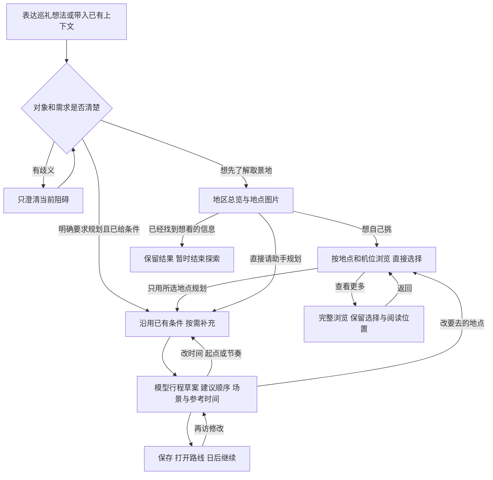

# Chat 用户旅程与组件对照

设计复核日期：2026-09-13。状态：**旅程讨论稿；已确认决定、历史设计、当前实现分别标注。** §8 的实现观察仍为 2026-09-09 快照。

本文是 Chat 交互决定的维护入口：先说明用户每一步要完成什么，再确定组件职责。
[全产品用户旅程](user-journey.md) 维护发现、判断、规划、现场巡礼和分享的整体关系；本文覆盖 Chat，以及作品页、路线页与 Chat 的交接。
开发排期仍在 [当前迭代入口](../iterations/README.md)，本文不另建任务看板。2026-09-10 起逐个评审前端组件；暂不修改页面布局或后端。

“前端已接入”表示本地源码能追到调用关系，不等于真实后端端到端验证。旧文档的 APPROVED、实现进度和数据规模，均按其日期理解。

## 1. 本轮的产品边界与已确认决定

Chat 帮用户把对一部作品的兴趣，逐渐变成一条自己愿意去、能理解怎么走的路线。
用户也可以只确认某个画面的取景地，暂时结束探索；不要求每次搜索都生成路线。
产品的长期目标仍是可带到现场使用的路线；**第一阶段先由模型生成行程草案，不接入真实路线规划服务**。保存和再访仍是 Chat 的正常收尾。

| 决定 | 本轮采用的边界 |
|---|---|
| 主线用户（2026-09-09 确认） | 知道喜欢的作品，想规划一次巡礼。作品明确时跳过消歧；已有条件不重复询问。 |
| 首回合（本次对话更新确认） | 只说作品、尚无地区和时间时，先展示地区和按地点组织的图片。第一阶段不判断“代表场景”，不做经典／人气推荐排名；按稳定顺序展示少量分组，再继续浏览。 |
| 看图与选择（2026-09-09 确认并已接入） | 图片始终看大图；文字区右下角常驻小按钮直接选择／取消；整卡反馈选中。不先切换模式，不要求看完图再去另一处选点。 |
| 第一阶段取舍（2026-09-09 本轮讨论） | “选几个必去点，再让助手补全”即 SP9 后置。已选地点保持精确名单语义；完全不选点时，仍可直接请助手规划。 |
| 第一阶段规划能力（2026-09-10 确认） | 模型依据已知地点资料、所选名单和用户条件给出顺序与停留建议。不接入真实道路算路或路线优化服务；时间属于参考估计，不表示已验证走得通或走得完。 |
| 完整浏览（本次对话 mockup 已认可） | 桌面从 Chat 结果进入右侧浏览区，左侧保留对话；图片与地图联动、共享选择。关闭后恢复 Chat；移动端用全屏浏览承接。基础浏览区不包含完整路线编辑工作台。 |
| 所选确认（本次对话 mockup 已认可） | 底部固定显示地点数量、“查看所选”和规划入口；数量多时不堆地点标签。查看所选在同一右侧区域切成清单，按地点检查／移除；单个取景位置直接显示名称，多个才展开。 |
| 已有草案的调整（2026-09-10 纠正并确认） | 草案包含完整地点、图片和安排，修改也围绕同一份草案进行。在地点行移除、展开取景位置修改选择，列表末尾添加地点；文字调整收在草案底部。所选清单主要用于生成首版前的核对，不作为已有草案修改的必经入口。 |
| 图片范围（本次对话已确认） | 覆盖 Chat 搜索场景图及作品页的场景集合；作品封面只解决作品识别，不能替代地点场景体验。 |
| 视觉约束（本次对话已确认） | 沿用 Animal Island 组件库与 Tailwind；地图沿用 MapLibre；暂不做夜间模式；本版暂不放小狐狸 logo。 |
| 组件评审顺序（2026-09-10 确认） | 只改前端组件，每完成一个先单独展示、评审，再继续下一个；页面组合后置。 |
| 数据与文案（2026-09-10 纠正） | “台阶上方 · 回望街道”是早期 Storybook 手写样例，不是接口字段。没有可靠取景位置名称时显示已有地点名，不生成视角、方向或地理关系。 |

上述 mockup 的认可不表示交互已经实现。以下未标为确认的转场、文案与组件边界仍为设计建议；图片定形后再完善组件。

[SceneGroupCard](../../apps/web/src/features/chat/components/SceneGroupCard.stories.tsx) 已经独立评审：单张取景位置卡，沿用已有地点名和图片素材；多图成员是显式前端样例，未接入真实聚合数据。覆盖独立选择、大图翻页、无图、长名称、窄屏及 520 张图片的单组容量。此前左右分栏页面演示已撤回。
[PlaceMapMarker](../../apps/web/src/features/chat/components/PlaceMapMarker.stories.tsx) 已经独立评审：默认只显示紧凑标记；悬停、键盘聚焦或触屏点开时显示地名与独立选择按钮，离开／失焦／点空白处收起。最新打磨版把整条选中地名框与标记统一为组件库主色 `#19c8b9`，配深色文字与勾；查看焦点只保留轻描边，不再用常驻金色圈或地名表达。无“正在看”图例和操作说明。预览沿用真实 MapLibre / Protomaps 底图与已有坐标样例，覆盖长名称、窄屏和边缘位置。尚未接入 Chat 页面；点标记发出查看地点的事件，与图片的联动留到组件组合阶段。

[SelectionSummary](../../apps/web/src/features/chat/components/SelectionSummary.stories.tsx) 已经独立评审：地点数量与“查看所选”共用左侧点击区域，右侧是金色“继续规划”。不堆地点标签；同一宽度下数量变化不增加高度，极窄容器把主按钮放到下一行。该组件保留零选择与等待态的摘要位置，一处地点即可继续。计数由外部提供去重后的停留地点数量；Storybook 数字是明确的前端样例，不代表已实现真实聚合。两个入口分别发出事件供 Actions 检查；与所选清单、模型请求及页面的组合尚未接入，也不调用现有 `SelectionTray` 的路线重算服务。

[SelectedPlacesList](../../apps/web/src/features/chat/components/SelectedPlacesList.stories.tsx) 已经独立评审：按地点显示小图、已有名称和移除入口，多个已选取景位置才展开；图片直接打开组内大图。移除整处或单个位置后可撤销最近一次操作，保留成员画面和原顺序；计数按地点计算，长清单在组件内滚动。Storybook 覆盖无图、加载失败、长名称、窄屏、多语言、80 处地点与单位置 520 张图片。地点和素材沿用仓库样例，多位置分组与容量数据是合成的前端样例，不表示真实地理聚合。选择由调用方传入并通过回调更新；返回只发出事件，页面、底部摘要和地图阅读位置的接线仍留到组合阶段。

[TripConditions](../../apps/web/src/features/chat/components/TripConditions.stories.tsx) 已经独立评审：已知条件回显、缺项按需填写，未知条件也能继续生成一版建议。使用无外框布局和组件库控件；未接入页面或模型请求。

[ItineraryDraft](../../apps/web/src/features/chat/components/ItineraryDraft.stories.tsx) 已经独立评审：用「行程草案」标识模型建议，回显用户条件，按调用方顺序保留地点、取景位置和画面。停留时间仅显示显式提供的参考估计，不推导到达时刻或交通耗时；假设与已知条件分开呈现。多位置可以展开并翻阅组内图片；缺图不移除地点。调整中或调整失败时仍可查看旧草案，保存与调整回调携带当前展示版本的 id。Storybook 的东京地点与图片来自不同作品的仓库样例，不暗示共同作品归属；建议文字、停留范围与分组是前端示例。地图组合、模型调用、保存与页面接线仍未接入。

[DraftAdjustment](../../apps/web/src/features/chat/components/DraftAdjustment.stories.tsx) 与 `ItineraryDraft` 复用完整草案的展示结构，保留地点、图片和已知条件；每站可以移除并撤销，多个取景位置展开后直接修改选择。末尾的“添加地点”展开基于调用方候选的图片选择区，点图片看大图、右下角选择；完成后仍在当前草案内。文字输入缩为草案底部的一段，“晚点出发”“轻松一点”只追加可编辑的文字；仅修改地点也能提交，不强迫再写一句话。

修改中的名单与原草案分开保留。地点或取景位置变化后，旧模型文字、停留范围与假设可能不再适用，暂时收起并标明待重新安排；组件不自行生成新的顺序或时间。提交携带原草案 id、明确的地点／取景位置名单和修改需求。等待与失败时保留输入和名单，防止重复提交；“查看原草案”回看未改动的版本，再进入调整仍保留这轮修改。Storybook 已演示这些前端交互，提交后只进入等待态，不伪造模型结果。候选使用仓库的东京样例，四ツ谷駅没有提供图片；分组仍是前端样例，不表示完整目录。完整图片／地图浏览、Chat 页面、模型请求恢复与保存接线仍后置。控件沿用 Animal Island Button、Checkbox 与 Input 样式层，多行输入使用原生 textarea。

**大量地点的组件形态（2026-09-10）：** 草案默认显示紧凑清单，每行保留缩略图、原顺序、地点名和已有地区；点名称展开这一站的建议、参考停留时间和取景位置，点缩略图仍直接看大图。每次展开一站。较长清单提供查找，匹配地点名、已有地区与取景位置名称；查找仅缩小显示范围，不改名单、不重编号，提交仍携带全部已选地点。草案内容在一个有高度上限的区域内滚动，更新／回看原版与撤销留在底部，文字调整可由底部入口直接定位。当前数据没有分天信息，因此仍按传入顺序呈现，不由组件编造天数或重排地区。30 处地点的 Storybook 使用明确标注的重复样例身份验证容量，不表示 30 处真实目录地点或已验证可行的路线；候选图库的完整加载策略与页面组合仍后置。

[DraftSaveActions](../../apps/web/src/features/chat/components/DraftSaveActions.stories.tsx) 已经独立评审。保存反馈留在完整草案底部；未登录时说明保存的用途，只在用户点击后打开现有 `LoginModal`。登录状态尚未确定时保存入口等待，不能提前打开登录墙。保存中锁定重复保存和编辑，地点与图片仍可查看；成功后用轻量确认和“查看行程”入口承接，保留整份草案。可重试失败原位重试，不可重试失败保留查看和调整入口。状态携带对应草案版本 id，旧版的保存结果不会被显示成新版已经保存；查看动作携带调用方提供的已保存结果 id。

新组件沿用旧 `RouteActions` 的保存／登录／失败语义，展示层使用 Animal Island Button 与现有主题。当前只接入前端草案组件，所有保存结果由调用方传入；Storybook 的成功是明确的状态样例，点击保存只进入等待，不伪造服务成功。登录表单在 Storybook 中隔离邮件发送，关闭弹窗保留草案与展开位置。真实草案保存契约、保存结果 id 的取得、登录后续存、已保存页面导航与 Chat 页面接线仍待组合阶段确认。

[RecentConversations](../../apps/web/src/features/chat/components/RecentConversations.stories.tsx) 已经独立评审。最近会话列表独立展示标题和首句提问摘要，当前会话用淡绿整行高亮；长标题最多两行，完整名称仍作为链接名称和悬停提示。没有标题时使用首句提问，再缺失才显示本地化的“未命名会话”；不重复相同的标题和摘要。使用现有 `ConversationSummary` 字段与原顺序，不生成时间分组、作品封面或已保存标记。最近会话负责回到对话；保存后的“查看行程”负责打开已保存草案。

组件明确区分首次加载、成功空列表、失败重试和已有数据的刷新。刷新中或刷新失败保留旧列表、当前会话与键盘焦点；未启用时隐藏列表，避免露出旧缓存。长列表在组件内滚动。链接携带原 session id，普通点击可由调用方接管，修饰键点击保留浏览器新标签页行为。Storybook 使用手写会话样例，点击只更新选中态，重试只进入等待态；不演示真实历史已经恢复。组件沿用 Animal Island 的链接样式层和 Button；当前尚未替换 `ChatSidebar`，也未修改会话请求、重试或富内容恢复流程。

[HistoryList](../../apps/web/src/features/chat/components/HistoryList.stories.tsx) 已经独立评审。历史回放沿用现有消息排版、图片大图与草案文档；旧消息保持静态，不重新演示生成过程，不将内部 intent 名称显示为处理结果。地点图片可以打开原有组内画廊；草案保留地点、画面、条件与参考说明。历史卡片用于回看，不直接更改当时的选择；“继续调整”携带用户选中的那版草案 id，由调用方承接。回放不推断哪版已保存，也不把模型草案升级为已核验路线。

恢复中、失败、成功空内容和部分缺失分别呈现。缺失地点图片或草案在原位置说明，保留可用消息和内容；刷新同一会话时保留已展开图片，调用方切换 session id 后关闭旧会话的预览。恢复尚未完成时仍可看图，但草案继续入口等待。新增的富内容块是前端展示模型，只有调用方明确提供才显示，不能从文字或 intent 拼出草案。现有 `HistoryEntry` 仍兼容；`useConversationHistory`、请求契约、Chat 页面及状态接线均未修改。Storybook 的会话文字为手写示例，复用已有地点和跨作品图片素材；重新加载只进入等待，“继续调整”只记录回调，真实历史恢复与编辑接续仍待后续接线。

**双栏归属（2026-09-10 确认）：** 历史回放放在 Chat 栏，与后续新消息连续呈现。右侧承接当前正在浏览或调整的对象；点击历史草案的“继续调整”才打开对应版本，单纯滚动或回看历史不切换右侧内容。这是页面组合的交接规则，目前尚未接线。

[WaitingRitual](../../apps/web/src/features/chat/components/WaitingRitual.stories.tsx) 的等待反馈收为消息流里的青绿色小转环与一行状态，不带外框、吉祥物或氛围语录。提交后只说明正在等待回复，15 秒后补一条较久等待的说明；经过的时间不代表正在搜索、算路或即将完成，不显示进度百分比或倒计时。开始流式响应、完成或失败后让位给对应内容／错误提示，不在等待组件里增加重试或取消动作。新用户消息重置等待计时，同一消息的数据刷新保留已等待时间；重试同一消息会重新计时。

新版复用 `TypingIndicator` 与 Animal Island 主题色，布局和转环使用 Tailwind；组件库的 `Loading` 是完整岛屿场景，不适合这一行内状态。减少动态效果时转环静止，状态文字仍保留。Storybook 覆盖常规、较久等待、前一条用户消息、窄屏、中英日文及非等待态隐藏；只有 Active 样例运行真实的前端计时，其他阶段为显式展示状态。未改 Chat 页面、请求或模型处理逻辑。

等待词汇的二次元风格与处理步骤的展示留到 [enhancement #1581](https://github.com/lifeodyssey/animichi/issues/1581)；此前提出的通用词汇未获认可，不作为已定稿文案。

[PhotoSearchUpload](../../apps/web/src/features/chat/components/PhotoSearchUpload.stories.tsx) 已经独立评审。上传后保留一张紧凑附件卡，显示实际文件名、原图缩略图和识别状态；点图沿用 `ScenePreview` 查看完整图片。识别中不编造进度或阶段，并锁住重复上传；失败后直接用同一文件重试，或换图、移除。格式不支持／超过 8 MB 时不读取预览、不请求服务，只提供换图；验证失败可重试，额度问题保留真实指导，不把换图说成解决办法。较长说明在卡片内占满一行宽度，避免在缩略图旁形成狭长文字列。

附件使用浏览器临时图片地址，替换、移除或组件卸载时释放；卸载后的迟到结果不再更新界面。识别结果继续走 `DataPartCard`，图片候选仍确认对应的服务端 photo offer，不转成会话澄清。这里只调整前端组件、局部文件状态及 Storybook，未修改请求契约、后端或 Chat 页面布局。展示与按钮沿用 Animal Island 1.10.0 和 Tailwind。Storybook 覆盖识别中、结果已返回、需要补充线索、失败重试、无效文件、验证／额度提示、图片无法显示、长文件名、窄屏和中英日文；识别结果为显式状态样例，图片取自仓库既有素材，不代表真实识别。文件选择和本地预览可操作，Storybook 隔离识别请求，重试只进入等待，不消耗额度。

[LocationPrompt](../../apps/web/src/features/chat/components/LocationPrompt.stories.tsx) 已经独立评审。当前位置与手动地点收在一个无外框的紧凑区域，手动输入和发送按钮在同一行；使用 Animal Island Button、Input 与 Tailwind。点定位才调用既有平台适配层；等待、不可用时仍可手动输入，已有文字不因定位状态变化丢失。手动提交后忽略迟到的定位结果。提交反馈收为所选地点与一行“已发送”，回显用户填写的名称或“当前位置”，不展示内部经纬度，不暗示已经找到了圣地。文案使用通用“地点”，同时适用于附近搜索与出发地补充。

保留父级禁用、空白校验、Enter 提交、重复请求防护及卸载后的结果失效语义；输入框有可点击标签，字号至少 16px，不在手机上自动弹键盘。Storybook 覆盖初始、填写中、定位等待、不可用、两种已提交、禁用、长名称、窄屏和中英日文。展示状态为前端样例；普通预览点定位只进入等待，另有实际组件通过既有 Storybook 平台桩进入不可用状态，不读取浏览器真实位置。未修改 Chat 页面、地理平台接口、地图或服务请求。

[EnvelopeFallback](../../apps/web/src/features/chat/components/ErrorStates/EnvelopeFallback.stories.tsx) 已经独立评审。未识别作品与空搜索结果改成无外框的恢复入口：一句状态、一段具体提示和可直接补充线索的输入。移除重复的“找不到”副标题及与当前任务无关的固定推荐；未识别作品可补充别名或剧情，空搜索可换作品或地区。超时和回复失败则重试已有消息，按钮沿用现有 `regenerate`，不要求重新输入。使用 Animal Island 1.10.0 Button、Input 和 Tailwind，不带吉祥物。

空结果不再推断“作品未被 Anitabi 收录”：同一状态也可能来自附近搜索或空草案。已有地点缺坐标时保留地点卡片，仅说明无法在地图上展示，不显示空目录提示，也不要求用户放弃这些结果。这里仅调整 `SearchResult` 的空态参数，没有改底图、标记或数据请求。

线索通过既有 `ChatActions.send` 提交，保留用户输入并以小勾和文字确认动作已发出；这不表示搜索已成功或已有新结果。空白及同一句重复提交被拦截，修改线索后可重新发送；父级忙碌或额度锁定时输入和重试禁用，未发文字保留。Storybook 覆盖未识别、空结果、缺坐标、超时、失败、输入中、已发送、禁用、长线索、窄屏及中英日文。发送／重试只记录回调并进入等待边界，不请求后端、不模拟成功结果；Chat 页面组合保持后置。

[LoginModal](../../apps/web/src/features/auth/ui/LoginModal.stories.tsx) 已经独立评审。登录弹窗以邮箱表单承接保存时的登录需求，使用 Animal Island 1.10.0 Button、Input 和 Tailwind。奶油色弹窗保留紧凑标题、明确的邮箱标签与金色发送按钮；不带 logo 或额外装饰。发信被确认后切换到“去邮箱完成登录”，完整显示收件地址，长邮箱换行，提供重新发送与修改邮箱。发信成功不表示用户已经登录，也不表示草案已经保存。

发送中保持邮箱只读并锁住重复请求，重新发送保留上一次已确认的收件地址；失败显示可重试反馈，保留输入。修改邮箱回到原输入并恢复焦点；发送确认后焦点转到新标题。桌面初始聚焦邮箱，手机先聚焦弹窗，避免自动弹出键盘。弹窗通过 portal 避免被卡片裁切，打开时锁住背景滚动，支持 Escape、点击遮罩关闭与焦点返回；矮屏在弹窗内滚动。

保留现有 `onSendCommitted` 在请求发出时触发的保存交接语义，以及已有的登录回跳地址校验。这里只改登录组件、局部表单状态与 Storybook，未修改 auth SDK、登录回调、保存重放、页面布局或后端。Storybook 覆盖输入、发送中、已发信、重新发送、两种失败、邮箱校验、服务不可用、长邮箱及中英日文；展示状态是明确的前端样例，点击发送只进入等待，不伪造邮件或登录成功。ActualForm 沿用既有 Storybook 隔离桩，进入未配置状态，不联系邮件服务。

[StreamInterruption](../../apps/web/src/features/chat/components/ErrorStates/StreamInterruption.stories.tsx) 已经独立评审。回复中断提示收为消息末尾的小标记、状态说明和一个操作按钮，移除整条色底与左侧粗边框，沿用 Animal Island 1.10.0 Button 和 Tailwind。断线、超时、请求受限、上一轮仍在处理、对话状态更新、上一轮失败及未知失败继续区分；文案不把请求受限解释为平台拥挤，也不把所有恢复动作说成重新发送。

只有调用方明确传入 `recovering` 才显示小转环与“正在读取最新对话”，并锁住原按钮；点击本身不推断已经恢复或生成成功。读取结束后由调用方决定撤下提示或保留原状态，组件不新增自动重试、倒计时或续传原流的承诺。未知失败的错误详情默认收起，原始代码仍完整保留，长代码可以换行；读取中保持展开状态，换一个错误码时收起旧详情。请求分类、结构化选择重发、读取历史、页面布局与后端均未修改；真实恢复后富卡片的保留仍属于已记录的历史恢复接线缺口，不能用此处的展示样例充当端到端证明。

Storybook 覆盖七种中断原因、恢复中、带未完成回复的上下文、点击后等待、展开详情、缺少错误码、长代码、窄屏和中英日文。上下文文字是手写样例；点击只记录回调并演示读取最新对话的等待分支，不请求服务、不补出成功回复。键盘提示、至少 44px 的动作区域与减少动态效果一并覆盖。

[SessionExpired](../../apps/web/src/features/chat/components/ErrorStates/SessionExpired.stories.tsx) 已经独立评审。登录失效提示沿用无外框的消息流样式，以小锁标记、简短说明和主操作“重新登录”呈现；下方用“已完成登录？”说明较轻的“读取最新对话”入口。两项操作均使用 Animal Island 1.10.0 Button，样式采用 Tailwind 与现有语义色。不再承诺“内容不会丢”，也不把登录失效和免费额度用尽合并。

登录弹窗仍在原处打开，关闭后焦点回到登录按钮，上方内容和输入保持挂载。打开／关闭弹窗或发信成功均不代表已登录，不自动触发读取。只有调用方传入 `recovering` 才呈现“正在读取最新对话”，以状态文字和小转环反馈，并锁住两项操作；按钮保持挂载与键盘焦点，重复点击不会再次调用恢复。读取结束由调用方决定是否撤下提示，组件不伪造恢复成功。

Storybook 覆盖普通、登录弹窗、关闭弹窗未登录、读取中、已有对话上下文、点击读取后等待、窄屏及中英日文。上下文为手写样例，读取按钮只记录回调并演示等待；登录沿用现有未配置隔离桩，不发送真实邮件。本轮只改组件、文案、Storybook 和对应验证；登录 SDK、回跳地址、历史恢复逻辑、页面布局与后端保持现有边界，真实恢复与富卡片保留仍需后续接线验证。

[QuotaExhausted](../../apps/web/src/features/chat/components/ErrorStates/QuotaExhausted.stories.tsx) 已经独立评审。免费消息用尽呈现为静态小钟标记、“免费消息已用完”标题、恢复说明和“登录后继续”按钮，移除整条黄色底与粗左边框。它是 `status` 状态提示，沿用 Animal Island 1.10.0 Button、Tailwind 和语义色；其他预算／额度分支保留独立职责。

有有效恢复时间时，按用户本地时区显示月日与时分，避免跨天时只有“几点”产生歧义；缺少或无效时间时，仅说明额度恢复后可以发送。组件不编造倒计时，也不自行宣布额度刷新。输入提示改为“可以先写，稍后发送”，保留既有的可编辑草稿与发送锁定行为；登录打开、关闭或邮件送达都不解除锁定，真实身份变化与定时解除仍由已有调用方负责。登录保持原会话回跳地址，关闭弹窗后恢复按钮焦点。

Storybook 覆盖已知／未知时间、已有对话、空输入、保留草稿、原位登录、关闭后未登录、窄屏和中英日文。恢复时间是明确的固定样例（`2026-09-13T00:00:00Z`），对话和草稿为手写展示内容；复用真实 `ChatInput` 展示可编辑但不可发送的状态。登录沿用未配置隔离桩，不发真实邮件、不演示认证成功或额度恢复。本轮调整限于组件、相关文案与 Storybook；页面布局、额度规则和服务端接线后置。

[BudgetExhausted](../../apps/web/src/features/chat/components/ErrorStates/BudgetExhausted.stories.tsx) 已经独立评审。游客共用的当日体验预算用尽，使用静态暂停标记、“游客体验暂时暂停”标题和简短原因说明，与个人消息次数用尽及登录失效分别呈现。移除黄色警告条和粗左边框，状态文字通过 `status` 温和播报；“登录后继续”使用 Animal Island 1.10.0 Button，“使用自己的密钥”使用较轻的文本按钮，Tailwind 与现有语义色承担布局和层级。

密钥入口带展开状态，可原位打开、收起已有 `ByokUpsell`，先说明用途、密钥保管与账号要求，再由用户选择登录设置。普通登录保留当前会话回跳，密钥设置保留 `/settings#api-key` 去向；关闭弹窗恢复原按钮焦点并保留说明的展开状态。打开弹窗、发信成功均不代表登录成功或额度恢复；组件不提供倒计时、自动续发或自行解除限制。

Storybook 覆盖默认、已有回复、展开与收起、两种登录入口、关闭后未登录、窄屏和中英日文。上文为手写会话样例，登录沿用未配置隔离桩，不发送真实邮件、不演示认证或恢复成功。本轮只调整这个提示及其展开交互、文案、Storybook；已有密钥说明内容、登录 SDK、预算规则和 Chat 页面接线保持原有边界。

[ByokUpsell](../../apps/web/src/features/chat/components/ByokUpsell.stories.tsx) 已经独立评审。密钥说明使用淡底、无描边的小区域，标题和一句用途说明之后，以“费用／密钥”两行分别解释服务商账户计费，以及浏览器会话保存、请求传递与服务端不持久保存的边界。移除旧项目符号列表和长篇利益陈述，不再承诺无限使用；登录要求与“登录后设置”按钮相邻，清楚说明登录后前往密钥设置。

沿用 Animal Island 1.10.0 Button、Tailwind 和语义色；原有专用 CSS 已收回组件，按钮保留组件库样式，触达区域至少 44px。区域标题、费用与登录提示具有明确的辅助技术关联；多实例使用独立 id。沿用已有登录和 `/settings#api-key` 回跳，关闭后恢复原按钮焦点；发信成功不等于认证成功或密钥配置完成。

Storybook 覆盖独立说明、游客预算提示内展开、登录弹窗、关闭后未登录、窄屏和中英日文。预算状态是明确的组件样例，登录仍使用未配置隔离桩，不发送真实邮件、不读取或配置真实密钥。本轮只改说明组件、文案、Storybook 与验证；密钥存储、请求传递、服务端处理、设置页和 Chat 页面组合保持原有边界。

[ByokRejected](../../apps/web/src/features/chat/components/ErrorStates/ByokRejected.stories.tsx) 已经独立评审。密钥未被接受时，使用小型密钥标记、简短标题和检查设置的说明，移除旧红色错误条与粗左边框。状态文字由 `alert` 播报，“修改密钥”保留真实设置页链接，采用 Animal Island 1.10.0 的链接按钮样式、Tailwind 与语义色，触达区域至少 44px。

从 `TurnFailure` 提取为独立组件，沿用 `/settings#api-key` 去向并携带当前会话；没有会话时不补造 id。链接通过独立 id 关联错误说明，不提供重复发送、自动切换模型、清除密钥或自动修复操作。设置页和服务端判定仍沿用既有实现。

Storybook 覆盖独立提示、已有回复、无会话、键盘焦点、窄屏和中英日文。上文和会话 id 为手写样例，保留真实链接目的地，不演示真实密钥请求、修复成功或设置页往返成功。本轮仅调整提示组件、文案、Storybook 与验证，Chat 页面组合后置。

[ByokRequiresLogin](../../apps/web/src/features/chat/components/ErrorStates/ByokRequiresLogin.stories.tsx) 已经独立评审。使用自己的密钥但尚未登录时，将原有黄色提醒条与密钥说明合并为一个连续的提示：小型账号标记、登录要求、用途、费用与密钥保管信息，最后提供一个“登录后设置”按钮。移除叠套卡片和重复的说明标题，登录要求仍通过 `alert` 播报。

从 `TurnFailure` 提取独立组件；费用、保管说明与登录操作由 `ByokSetupDetails` 共享，沿用已评审的 Animal Island 1.10.0 Button 和 Tailwind 样式。按钮关联当前登录要求、费用和设置去向；关闭弹窗保留提示并恢复按钮焦点。回跳仍是 `/settings#api-key`，邮件送达不等于认证、密钥配置成功或允许重发。

Storybook 覆盖默认、已有回复、登录弹窗、取消登录、窄屏和中英日文。已有回复是手写样例，登录沿用未配置隔离桩，不发送真实邮件、不演示登录成功；真实认证、密钥设置及 Chat 页面组合后置。

[TurnstileGate](../../apps/web/src/features/chat/components/TurnstileGate.stories.tsx) 已经独立评审。游客进入对话前的访问验证使用轻量说明、小型验证标记和 Cloudflare 真实控件；移除旧粗边框卡片和红色重试条。应用只设计控件外层，保留供应商的品牌、挑战内容与验证反馈。等待、需要操作、等待服务端确认、失败分别由真实事件驱动；失败后提供 Animal Island 1.10.0 的单个重试按钮，触达区域至少 44px，文案和控件语言跟随中英日设置。

正式组件继续使用 `interaction-only`，需要用户操作时才显示验证框。按照 [Cloudflare 官方尺寸](https://developers.cloudflare.com/turnstile/get-started/client-side-rendering/widget-configurations/)，可用宽度至少 300px 时使用 `flexible`，不足时切换为 150×140px 的 `compact`；通过实际容器测量选择，不裁切、压缩或重新绘制验证框。显式挂载支持语言和尺寸变化及卸载清理，旧控件的延迟回调不影响新控件。收到控件 token 只显示“正在确认验证结果”，沿用已有服务端确认后才能进入对话的策略。

Storybook 的 RealWidget 系列使用 [Cloudflare 官方公开测试密钥](https://developers.cloudflare.com/turnstile/troubleshooting/testing/)，展示真实 SDK 的操作提示、自动验证、失败与窄屏尺寸；需要网络，测试说明放在组件之外。应用等待／失败／重试状态另有不加载远程控件的固定样例。预览不保存测试 token、不调用真实验证接口、不模拟获得对话权限。本轮限于这个前端组件、控件挂载、文案与 Storybook，Chat 页面组合及服务端规则后置。

[ColdStart](../../apps/web/src/features/chat/components/ColdStart.stories.tsx) 已经独立评审。首次进入对话时保留“想走进哪个故事”的邀请，以简短说明引导先看作品的取景地，地区与时间可以后补。旧版三个等重的大功能卡片收为更突出的作品示例、较轻的城市示例，以及“还没想好，先一起聊聊”。按钮上展示的问句就是发送内容，避免点击作品入口后只发送未说明作品的泛化请求。示例是手写问法，不表示热门排名、推荐结果或已核实的目录覆盖。

按钮使用 Animal Island 1.10.0，布局与色彩使用 Tailwind 和语义 token；保留原生键盘操作、至少 44px 触达区域与受控禁用，不抢输入框焦点。移除“看看示例对话”入口，因为原实现只会发送一条要求生成示例的新请求，并没有可供打开的示例。作品与城市示例直接进入已有 `onChip` 发送路径，没有新增模式选择、强制条件表单或第二个输入框。

Storybook 覆盖默认、作品／城市选择反馈、键盘焦点、禁用、窄屏和中英日文；反馈仅展示将发送的原句，未发送请求，也不模拟模型回复。组件在页面中继续承担原来的起步引导职责；本轮没有修改 Chat 页面布局、请求处理或后端能力，完整旅程交接仍在组合阶段评审。

[SkeletonCard](../../apps/web/src/features/chat/components/SkeletonCard.stories.tsx) 已经独立评审。已收到内容类型、完整内容尚未到达时，用青绿色小转环与一行接收提示承接；移除整块闪烁底色、边框和阴影。复用已评审的 `TypingIndicator`、Animal Island 语义色与 Tailwind，不另造图片槽或地点数量。搜索、行程、澄清及普通回复分别说明正在接收什么；内容类型不代表工具正在执行哪个步骤，也不提供百分比、倒计时或自动推进的文案。

完整内容到达后由原有 `DataPartCard` 原位替换；流已结束而没有完整内容时，小转环收为静态内容标记与“这段内容没能完整接收”。错误帧仍立即进入已有错误提示，未知格式仍走原有兜底。状态用 `status` 温和播报，不用 `aria-busy` 延迟等待文字的播报；减少动态效果时转环静止。占位不替代上一份可用草案，也不增加没有真实回调的重试操作。

Storybook 覆盖内容类型、对话上下文、接收转完整内容、结束但缺少内容、窄屏及中英日文。切换按钮是预览工具，只替换同一个组件的本地属性；对话和澄清卡为固定手写样例，图片复用已有素材，不发送请求、不演示真实流式接口。本轮限于加载组件、其渲染分支、文案与验证，Chat 页面组合、传输协议和后端保持现有边界。

本轮最后补齐 [ChatAppBar](../../apps/web/src/features/chat/components/ChatAppBar.stories.tsx)、[MapFallback](../../apps/web/src/features/chat/components/ErrorStates/MapFallback.stories.tsx) 与 [SceneThumb](../../apps/web/src/features/chat/components/ErrorStates/SceneThumb.stories.tsx) 的组件实现和独立预览，随完整组件 PR 评审。顶部栏使用纯文字名称与至少 44px 的登录、新对话、设置操作，取消登录恢复焦点；地图失败改为静态地图标记和简短状态，仅在坐标有效时提供 Google 地图入口；图片可用、缺失与加载失败共用稳定的 88×56 槽位，缺失时保留地点名称与实际传入的话数。

三者沿用 Animal Island 1.10.0 与 Tailwind 语义色，不新增吉祥物、夜间设计或无真实回调的重试。地图预览包含真实 `StaticSpotMap` 的失败分支；图片预览复用已有素材，故障地址和认证状态均为显式样例。完成独立组件不代表已接通浏览、规划、保存的整段交互。下一阶段以 [#1641：Chat 旅程衔接](https://github.com/lifeodyssey/animichi/issues/1641) 跟踪组合 Storybook、状态归属、返回位置和异常恢复，先评审连贯旅程再安排页面接线。

## 2. 重读旧设计后，哪些要沿用、哪些不能直接照搬

| 来源 | 找回的设计意图 | 对本轮的影响 |
|---|---|---|
| [4 月旅程重设计](../archive/specs/2026-04-15-journey-redesign-design.md)、[4 月旅程契约](../archive/specs/2026-04-22-backend-frontend-journey-contract-design.md) | 表达／解释／澄清由对话承载；探索、比较、选择由结果承载；完成条件依用户问题而定。 | 保留职责区别。旧三栏、浮动聊天窗与旧组件名不作为当前布局目标。 |
| [6 月 Chat 设计 §1–4.1](../archive/specs/2026-06-12-chat-page-design.md) | 单列对话流先行；候选卡也是输入；机位约 10m 聚合，路线停留点约 50m 聚合。 | 看图和选点必须协同。微观聚合与地区总览是两层能力，不能混为一种 cluster。 |
| [6 月状态清单 C／SP／H](../archive/design-sync/docs/spec-chat-page-states.md) | 作品 → 地区 → 少量场景 → 完整浏览 → 路线；浏览排序与路线顺序独立。 | 保留渐进展开与返回路径；A/B/C/D/E/SP/G 是状态分类，不是七步强制向导。 |
| [全产品旅程 §3.3、§6.5、§6.9](user-journey.md) | 停留地点 → 机位 → 单帧；路线是核心资产；桌面排好后能带到手机。 | 选择的画面要能在路线里找回来；保存后只剩聊天文字不算交接完成。 |
| [7 月文字走查 §1–2](../archive/design-sync/docs/journey-走查.md) | “查看更多”从结果进入，返回同一对话；缺出发条件的追问位于排路线前；公开路线可带入改装。 | 补全场景之间的交接，不能只检查卡片内部。文中的“改装更高频”是当时的产品判断，并非已验证用户数据。 |
| [重建总纲](../specs/2026-07-06-frontend-rebuild-spec.md)、[Chat 第一期](../specs/2026-07-06-frontend-rebuild/iter-1.md) | 单列流、必要的 C2t 出发询问、保存登录墙、断流后读取会话最终状态、图片识别支线。 | 覆盖正常旅程及恢复；旧稿中的 Mapbox、登录未决、续传原流描述已被后续规则取代。 |
| [工作台第二期 S6.1–S6.6](../specs/2026-07-06-frontend-rebuild/iter-6.md) | 桌面双栏、常驻地图、多图浏览器、SP8 草稿编辑、SP9 锚点委托。 | 记录能力来源及原分期。基础聚合／看图若提前补入，需要明确范围，不能顺带启动整套工作台。 |

**本轮消解的冲突：**

- 旧走查曾默认预选若干地点；当前采用用户主动选择，展示出来不等于已经选中。
- 旧 SP8 写“超过 100 个地点自动先选 8 个”。它属于后续草稿编辑；第一阶段不因图片多而越过已确认的“先看地区和场景”。
- 旧稿中“虚拟滚动 >50／≤300 直接渲染”等说法不一致。这些是历史实现设想；当前应先降低选择负担，再以真实数据决定渲染策略。
- 停止／排队发送在旧 G4 中明确后置。当前没有停止按钮，不单独算作第一阶段的新需求；失败后保留草稿和恢复原任务仍需覆盖。
- 历史样本的单季约 200、系列合并 499／829 等数字不是今天的数据上限。用户提出的五百多张图是本轮必须覆盖的规模场景。
- 旧稿的精确时刻表、道路路线与可行性计算属于后续目标。本轮的模型行程草案边界优先；既有源码是否调用规划服务需在实现阶段单独核对，本次文档修改不代表服务已删除或切换。

## 3. Chat 主线：六段任务，可跳过、可回退

**表达想法 → 看地区和场景 → 按需挑地点 → 按需补出行条件 → 看行程草案并调整 → 保存与继续。**

这是任务地图。一个阶段可以跨多个回合，一个回合也可以满足多个阶段。

| 阶段 | 用户此刻的问题 | 需要看到什么 | 主要动作与进入下一段的条件 | 必须带过去的内容 |
|---|---|---|---|---|
| 1. 表达想法 | “我想去这部作品的取景地，从哪里开始？” | 简单输入与示例；从外部进入时先显示已带入的作品／路线。只有真实歧义才显示候选。 | 说作品、需求或上传图片。对象明确后给结果；条件齐全且明确要求排路线时进入第 4 段。 | 原话、作品及系列范围、已给地区／时间／起点；有引用时保留来源。 |
| 2. 看地区和场景 | “在哪里？哪些画面值得我去看？” | 简短回应、主要地区、按稳定顺序展示的地点分组与图片。跨远距离地区时给地区总览；分组封面不表示推荐排名。 | 单地区直接看地点；多地区选择本次范围。可看图、直接请助手规划，也可只探索后离开。 | 作品、当前地区、结果范围；不能把浏览某地区自动当成选择全部地点。 |
| 3. 按需挑地点 | “这些里面，我这次想去哪些？” | 按物理位置组织的场景组、图片数量、大图、右下角选择；完整浏览入口与所选摘要。 | 卡上一次点击选择；需要时展开全部，回到原处。第一阶段按所选名单规划，不自动补其他圣地。 | 稳定的选择对象、成员画面、地区与滚动位置；同位置多张图不增加多份选择。 |
| 4. 按需补出行条件 | “我从哪出发，有多久，什么时候开始？” | 已知条件的简短回显；只问有助于建议的缺项。建议允许“先给一版建议”，起点／时间尚未决定也可继续。 | 按现有信息给出草案，缺项与假设说明清楚；不把填完表单作为模型给建议的统一门槛。只想看圣地时不提前进入此段。 | 选择名单、已确认条件、暂未确定项与明确标注的假设。不能把建议的起点冒充用户已确认。 |
| 5. 看行程草案并调整 | “大概怎么逛？我选的画面都在吗？” | 模型建议的地点顺序、停留安排、场景与理由；地图显示真实地点分布。给时间时使用大致范围，说明尚未核验实际通行。 | 接受草案，或用一句话改时间／起点／节奏，或改名单再安排。新草案成功后明确它是当前版本；不承诺最优顺序或必然走完。 | 当前可用草案、选择到停留站的对应关系、已知资料与估计的区别、修改需求与旧版本。 |
| 6. 保存与继续 | “怎么带走？明天还能找到和修改吗？” | 保存反馈、适用的地图／路线入口；登录用于保留与跨设备使用；再访能找到同一产物。 | 保存、打开路线或离开。登录／失败重试后仍回刚才的路线；再访继续第 5 段。 | 路线身份及版本、会话、待完成保存动作。现场 Walk 与分享由相邻旅程承接。 |

### 用同一部作品走一遍

示例：“想去《吹响吧！上低音号》的取景地。”先给宇治的地区信息和按地点组织的图片。
用户看清画面，选择宇治桥和大吉山；相同机位的其他截图收在同一组里。
点“用这些地点规划”后，沿用已知信息，按需问出发地与时间；第一阶段由模型为所选地点给出行程草案。
用户看到草案后说“晚一点出发”，继续调整同一次巡礼。保存时登录，回来仍是同一份行程及所选画面。
该段是旅程示例，不代表这些前后端接续已经全部实现。

## 4. 地点聚合：先统一选择对象，再确定卡片

“按地点聚合”至少涉及四种不同尺度，用户不必逐级打开四层页面：

| 层级 | 用户在做的判断 | 设计单位与显示职责 |
|---|---|---|
| 地区 | “这次去东京还是飞驒？” | 地区总览／圈卡，帮助缩小一次出行范围。它不是同地点多图去重。 |
| 停留地点 | “这一站停在哪里，要留多久？” | 路线中的一站，可包含附近几个拍摄机位；历史方案约 50m。 |
| 取景位置／机位组 | “我要重现桥的哪一侧、哪个角度？” | 历史 SpotPicker 的候选卡单位，约 10m；分组封面＋同组截图数，避免把不同构图粗并。 |
| 单帧 | “是我记得的这一幕吗？” | 大图及有数据时的话数／时间戳。翻到另一帧不应自动多选一处地点。 |

**沿用旧意图的呈现建议：** 浏览按地点组织，保留可区分的机位；同机位多帧收在一组内。
卡片以地点名称和分组封面为入口，点图片直接看同组画面，右下角直接选这一组；封面可用固定首图，不引入代表场景判定。
不增加“点图跳地点列表、再点地点、最后才能选择”的必经步骤。
同一停留地点下的不同机位被选中后，可以合并为路线的一站，但要保留用户挑过的画面。

上一轮“一地点一张卡”的简述不足以表达这层区别：不能把整座桥、整条街的不同构图全部折成一个不可区分的候选。
卡片最终使用机位组还是更上层的地点容器，需要用真实作品样本评审；此处先固定层级与不丢画面的原则。

### 五百多张图怎样逐层看

1. 先确定作品范围和本次地区，按稳定顺序展示少量地点分组；第一阶段不筛选代表场景、不做“人气／经典排名”。
2. 同位置聚合后再展示数量，明确区分图片数、可选取景位置数和路线站数。
3. 想继续看才进入完整浏览；按地区展开，系列／话数信息在可用时帮助缩小范围；只加载需要看的图片。
4. 大图在组内连续浏览；返回时恢复当前地区、分组展开状态、阅读位置和选择。
5. 第一阶段不自动切到 SP8 草稿编辑，也不引入 SP9；不能因为图片多就默认替用户勾选。

10m／50m 是历史设计参考值，并非语义正确性的保证。旧实测已发现单链接聚类会把整条街链式合并。
接入前必须抽查同位置多帧、桥两侧不同机位、密集街道、缺坐标、跨季重复等样本，判断是否保留了真实取景差异。
当前前端地区聚合用的是 **50km**；它不等于机位 10m 或停留点 50m 聚合。

完整浏览至少需要稳定的组身份、成员图片、来源与话数、分组封面，以及选择组到行程站点的对应关系。
只有封面和图片数量，尚不足以支持多图翻阅或完整选择；也不能把换封面造成的 id 变化当成用户重新选择。

### 浏览与所选确认的形态

- 默认在 Chat 内看地点图片；继续浏览时桌面展开右侧浏览区，左侧对话保留。手机全屏浏览，返回恢复原位。
- 图片／地图视图共享选择。点地图地点查看对应图片；查看与选择独立。mockup 的金色圈在当前组件打磨中收为轻描边，选中用组件库 teal 主色与勾表达；地名按需出现，不因正在查看或已经选中而常驻。
- 地图标记表达停留地点；点图放大，右下角小按钮直接选取景位置。看图、翻帧、移动地图均不自动改选择。
- 底部始终用固定高度的摘要：“已选 N 个地点”＋“查看所选”＋规划入口，选得多也不增加标签行。
- 查看所选在同一浏览区切成可滚动清单；按地点检查、展开多个已选取景位置、移除整处或单个位置。返回恢复之前的地图／图片位置。
- 上一张补条件 mockup 保留右侧清单、在左侧回复；其中“填完才开始”的交互须按 §5 模型草案边界重新评审。

## 5. 第一阶段的规划规则与范围

### 模型行程草案：已确认的能力边界

2026-09-10 用户确认：**第一阶段依靠模型自己的能力，不接入真正的路线规划。**

- 模型基于已有地点资料、真实坐标（如有）、用户所选与已知条件，建议游览顺序、停留安排并解释理由。地点与场景仍来自目录数据，不能因为没有算路服务就让模型编造地点资料。
- 第一阶段不接入道路算路、真实路程／耗时矩阵或路线优化服务。UI 的等待反馈只能描述正在整理建议，不演示“计算最优路线／校验交通”之类未发生的过程。
- 时间与可行性判断属于模型估计；展示大致范围和影响判断的假设，不显示貌似已经核验的精确到达时刻、最短路或“保证能走完”。信息不足时可不展示时间。
- 地图继续承担找地点、看分布和选点。行程草案中可显示有来源的地点标记；如示意建议顺序，只能明确为顺序示意，不能将直线连点或模型生成的线当作真实道路路线。
- 精确名单规则继续有效：不擅自增删所选地点。模型认为时间可能不够时说明估计与取舍建议，由用户决定；不能包装成已计算的不可行结论。
- 保存与再访应保留草案、所选画面和用户条件；保存不会使模型估计变成经过核验的导航路线。

**补条件组件已独立评审（2026-09-10）：** `TripConditions` 回显已有出发地、可用时间与出发时间，允许原位修改；缺少出发地或可用时间时才展开相应输入。可用时间支持半天、一天和自由填写；出发时间按需展开。缺项时主动作是“先给一版建议”，已有出发地和可用时间时为“生成行程建议”。空值保持未定，不默认推断车站、日期或时长；等待态只描述正在整理建议。当前仅有受控的前端组件和 Storybook，未替换旧 `DeparturePrompt` 的页面接线。未来组合时左侧按需补条件、右侧保留所选清单；已评审的结果组件以“行程草案”标识建议性质，调整入口正在独立评审。

### 两条简单入口

| 入口 | 用户交给系统的任务 | 第一阶段规则 |
|---|---|---|
| 没有选点，直接“帮我安排” | 根据作品、地区和已知条件建议一份行程。 | 模型从已有地点资料给建议，不先勾选全部候选；按需补条件。 |
| 自己选点后“用这些地点规划” | 为明确名单建议顺序和停留安排。 | 不自动加其他圣地；同站多个机位可以合并停留，所选画面仍需保留。估计时间不够时说明依据与取舍，不偷偷删选项。 |

只选一个位置时，它仍然是有效兴趣表达。当前托盘需至少两项才能提交；第一阶段可说明如何继续看、再选或查看该点信息，不能暗中用 SP9 补足数量。
当多项机位选择最终合并成一个停留站，也不能把“多个原始 id”误报成多站路线。
浏览列表的排序／筛选只影响看什么；路线的经过顺序由规划任务决定，不能因用户切到话数浏览而偷偷改行程。

### 范围建议，供旅程评审

| 第一阶段的主线目标 | 后续能力／本轮明确后置 |
|---|---|
| Chat 首屏结果；按地点看图／选择；右侧基础浏览区的图片／地图联动与所选清单。先确认 mockup，再接聚合数据与完整浏览。 | 完整路线编辑工作台工具条；不因基础双栏浏览提前引入整套编辑器。 |
| 模型普通建议与精确名单行程草案；按需追问；草案的查看、修改、保存、再访。 | 真实道路算路、路线优化、经核验的交通耗时与时刻表；SP8 自动草稿与局部替换；**SP9 必去点＋自动补全（本轮排除）**；剧情顺序、手动拖排及成本比较。 |
| 保留文字、图片、附近、历史等已有入口；把交接状态写清楚。 | 跨城市多日拆分、全作品库图片精确检索、协作规划；不因这次梳理扩大图片识别承诺。 |

## 6. 入口、回退与恢复：每条都要回到同一次巡礼

| 情况 | 该怎样进入／返回 | 需要保留的内容 |
|---|---|---|
| 空白进入／首页带 query | 空态帮助开口；带 query 直接延续，不能要求重输。 | 原始需求及已带条件。 |
| 已有完整条件 | 直接核对缺项并规划，不强制先看图或先选地点。 | 作品、地区、起点、时间预算与节奏。 |
| 作品／系列不明确 | 必要的封面候选＋都不是＋手动补充；确认后回到原目标。 | 原请求与系列范围；封面候选不能代替地点候选。 |
| 已在当地／附近搜索 | 用户选择定位或手动地点；拒绝定位仍能继续。 | 已知作品、搜索范围及已经提供的位置。 |
| 从图片开始 | 上传 → 可支持的识别结果 → 必要的作品／地点确认 → 地区与场景结果。 | 原图的任务上下文与确认结果；识别作品不等于已经精确找到该帧机位。 |
| 作品详情页进入 | 带作品及已知地区／选择进入 Chat，落在相应阶段。 | 不重复选作品、不丢已看和已选场景。当前交接尚未接通。 |
| 引用自己或他人的路线 | 显示引用对象，直接说要改什么；引用失效时说明并回到可用入口。 | 来源路线与本次修改；不把它冒充新生成结果。当前 route 引用尚未接通。 |
| 最近会话／离开后回来 | 恢复当前路线和富内容，再接着改。 | 会话、路线版本与必要条件；不能只恢复几段文字。 |
| 普通问答／暂不规划 | 直接回答，再允许回到原任务；不强推选择或路线。 | 原来的规划上下文。 |

### 上下文保持规则（建议，当前尚未全部接通）

- 看大图、翻帧、返回、切浏览排序、折叠分组：不改变选择或路线；恢复阅读位置与焦点。
- 只是在地区间浏览：保留已选，并能看清所选来自哪里；真正跨远距离规划时先说明范围冲突。
- 明确换本次作品／出行地区：展示上下文变化，旧结果留在历史；旧选择不能无提示带入新目标。清理／保留需要可见且可撤回。
- 改时间或起点：保持所选名单；模型估计可能排不下时说明依据并询问取舍。不能用“调整节奏”作为自动删点的授权。
- 新路线生成中或失败：上一份可用路线仍可查看；新版本成功后才明确替代关系。保存动作对应用户正在查看的那一版。

### 中断时的返回点

| 中断 | 用户应该看到／能做什么 | 恢复到哪里 |
|---|---|---|
| 未识别作品／暂无圣地 | 区分对象不明与该作暂无收录，给重新表达或换范围入口。 | 原请求的第 1／2 段。 |
| 图片、地图或坐标缺失 | 地点文字与可用选择仍在；失败图可退出；列表不依赖地图才能操作。 | 原浏览位置；缺坐标是否可参与路线须明确说明。 |
| 定位拒绝／上传失败 | 手动输入地点或重新选图；说明哪一步没完成。 | 同一个入口任务。 |
| 地点太少／跨区／时间可能不够 | 保留找到或选中的地点，区分已知的范围问题与模型估计的时间问题，给可行下一步；不将估计呈现为算路验证。 | 第 3／4 段，不静默补点。 |
| 断流／超时／生成失败 | 保留已看到内容与待办需求；区分仍在查结果、已失败和可重试。 | 读取当前会话最终状态，再恢复或重试；不许诺续传原流。 |
| 配额、匿名验证、会话认证 | 就地说明当前限制与适用的恢复入口，保留内容和草稿。 | 原会话。匿名验证／配额门槛与保存登录墙分别呈现。 |
| 保存或历史加载失败 | 显示失败和重试，不能用成功样式或空白新会话替代。 | 同一路线／同一历史会话。 |

## 7. 从旅程推导组件职责

下表是职责对照，新增容器的名称和具体拆分要在组合场景确认后决定。现有组件的外观被认可，不代表它已完成整段旅程。

| 旅程职责 | 已有组件可承担什么 | 接下来需要确定／补齐什么 |
|---|---|---|
| 接住意图 | `ColdStart`、`ComposerDock`、`ChatInput`、`PhotoSearchUpload` | 不同入口共享上下文；图片结果怎样回到消息流，避免在输入区下方形成独立任务。 |
| 消除当前歧义 | `ClarifyCard`、`ClarifyCandidateOption`、`ClarifyDetails`、`ClarifyTextEntry`、`LocationPrompt`、`DeparturePrompt` | 作品、地区、时间、定位、图片识别分别用合适内容；统一询问时机与已知条件回显。 |
| 理解分布 | `SearchCard`、`SearchResult`、`ClusterBubbleMap`、`StaticSpotMap` | 地区、地点图片与地图联动帮助决策；首图不承担代表性判断，与组内图片聚合保持不同职责。 |
| 浏览画面、选择取景位置 | `SearchSpotCard`、`SearchScenePhoto`、`ScenePreview`；作品页 `ScenesSection` | 从单图记录补为同位置多图；完整浏览入口、组内翻阅、退出回位；选择对象与数量一致。 |
| 确认规划名单 | `SelectionTray`、选择 provider；已独立评审的 `SelectionSummary`、`SelectedPlacesList` | 摘要和所选清单已获得外观认可；清单支持查看、撤选、展开与撤销。与浏览区的组合、跨地区提示、真实去重计数及失败重试仍待补齐。第一阶段不加入 SP9 模式。 |
| 按需补充出行条件 | 旧 `DeparturePrompt`；已独立评审的 `TripConditions` | 回显并修改已知条件，只展开缺项；未知条件可继续生成第一版建议。新版仅有展示、编辑和回调，页面交接与模型请求尚未接入。 |
| 看行程草案 | 旧 `RouteCard`、`TimedItinerary`、`RouteStopScene`、`SceneThumb`、`RouteTrailMap`、`RouteActions`；已独立评审的 `ItineraryDraft` | 新组件展示模型建议、所选画面与参考停留范围，保留当前可用版本供查看和保存。页面组合、地图分布与保存接线后置；精确时间字段和道路线不能因旧组件已有就自动显示。 |
| 接着草案调整 | 独立评审中的 `DraftAdjustment`、底部 `DraftAdjustmentInput`，复用草案地点行和 `SceneGroupCard`；既有 `ComposerDock` | 同一份完整草案内增删地点、修改取景位置，用文字改时间或节奏。前端预览可回看原版并保留修改；请求发出原版 id、明确名单与文字。真实请求、新版替换和页面接线后置；Chat 组合应承接一个输入入口，不能并排放两套输入框。 |
| 带走与再访 | 已评审的 `DraftSaveActions`、`RecentConversations`、`HistoryList`；既有保存流程、`LoginModal`、`ChatSidebar`；相邻路线页入口 | 保存反馈绑定草案版本；最近会话列表区分加载、空态、失败与刷新。历史回放新增明确的地点／草案展示块与缺失占位。当前富内容仍为前端样例，真实保存与登录后续存、列表重试、页面导航、历史找回和富内容契约仍需接线。 |
| 全程反馈与外壳 | `ChatPage`、`ChatShell`、`MessageList`、`DataPartCard`、`WaitingRitual`、`ToolStepBadge`、`SettledFootprint`、`SuggestionChips`、错误提示 | 输入／等待／结果／恢复属于同一任务。新版等待反馈只表达尚在等回复，经过 15 秒仅增加说明；不依据等待时长或作品名演示工具进度。二次元词汇增强已后置到 #1581；页面外壳与跨状态组合仍后置。 |

**当前 mockup 主线：Chat 地点图片 → 右侧浏览与地图联动 → 查看所选 → 左侧按需补条件 → 模型行程草案 → 调整与保存。**
主线 mockup 已经过本轮讨论；补条件、草案、调整、保存反馈、最近会话、历史回放、图片上传、定位／手动地点、搜索恢复、登录弹窗、回复中断、登录失效、个人免费消息、游客公共体验额度提示、使用自己密钥的说明、密钥拒绝提示、使用密钥前的登录要求、游客访问验证、首次对话引导与内容加载占位已完成独立评审。顶部栏、地图失败与图片占位已补齐实现，纳入完整组件 PR。接下来以 #1641 聚焦组件之间的旅程衔接；页面组合与真实数据接线后置。
已认可的卡片、输入区和消息样式沿用；本轮不重新做一套视觉方向。

## 8. 当前实现核对：哪些已有，哪些只是设计

下列为 2026-09-09 本地源码观察；不把 Storybook 存在、服务端字段存在当作完整旅程已实现。

| 能力 | 当前观察与旅程影响 | 源码依据 |
|---|---|---|
| 搜索与地区下钻 | 单地区有图点卡＋地图，多地区总览可下钻并返回；当前只提供粗地区聚合。 | [SearchResult](../../apps/web/src/features/chat/components/SearchResult.tsx)、[spot-clusters](../../apps/web/src/features/chat/lib/spot-clusters.ts) |
| 首屏截取 | 有图优先，同组保持上游顺序，截取前六；无经验证的人气排序，也不等于代表场景判定。 | [topSpots](../../apps/web/src/features/chat/lib/spot-clusters.ts) |
| 看图与直接选择 | 单图预览、右下角 Checkbox＋Cursor、44×44 点击区及整卡高亮已有；看图不改变选择，无图保留按钮。 | [SearchSpotCard](../../apps/web/src/features/chat/components/SearchSpotCard.tsx)、[SearchScenePhoto](../../apps/web/src/features/chat/components/SearchScenePhoto.tsx)、[ScenePreview](../../apps/web/src/features/chat/components/ScenePreview.tsx) |
| 地点多图 | Chat 的 `SearchSpot` 是一个 id＋一张图；作品概览按 50m 聚合后返回代表图与 `shot_count`，没有在该投影中返回全组图片。Chat 尚未接入组身份、成员图片及路线映射。 | [SearchSpot](../../apps/web/src/features/chat/lib/spot-clusters.ts)、[概览投影](../../workers/catalog/src/application/get-bangumi-overview.ts)、[AnimeScene 契约](../../packages/contract/src/models.ts) |
| 完整浏览 | Chat 只展示 top-6；没有接通“查看更多”与完整 SpotPicker。当前 `ScenePreview` 只接收单个图片地址。 | [SearchSpotCard](../../apps/web/src/features/chat/components/SearchSpotCard.tsx)、[ScenePreview](../../apps/web/src/features/chat/components/ScenePreview.tsx) |
| 两种规划入口 | 未选时“帮我安排”发普通对话；有选择时托盘发 `selected_point_ids`，至少两项可提交。没有 SP9。 | [SearchGalleryControls](../../apps/web/src/features/chat/components/SearchGalleryControls.tsx)、[SelectionTray](../../apps/web/src/features/chat/components/SelectionTray.tsx)、[use-recompute-turn](../../apps/web/src/features/chat/selection/use-recompute-turn.ts) |
| 选择上下文 | 集合按 id 存于会话级 provider，换会话重置；没有按作品／地区划定选择边界。不能称为地点去重已完成。 | [use-spot-selection](../../apps/web/src/features/chat/selection/use-spot-selection.tsx) |
| 出发追问 | 手动发送可被关键词规则拦下：检测到路线意图且同时缺起点与时间才追问；query 自动发送走另一条路径。不是完整的条件理解。 | [ChatPage](../../apps/web/src/features/chat/ChatPage.tsx)、[departure](../../apps/web/src/features/chat/departure.ts)、[use-departure-prompt](../../apps/web/src/features/chat/use-departure-prompt.ts) |
| 澄清与图片入口 | 作品候选、无候选补充、定位与图片确认有承载。图片结果复用卡片渲染，但仍放在输入区下面。 | [ClarifyCard](../../apps/web/src/features/chat/components/ClarifyCard.tsx)、[PhotoSearchUpload](../../apps/web/src/features/chat/components/PhotoSearchUpload.tsx)、[ComposerDock](../../apps/web/src/features/chat/components/ComposerDock.tsx) |
| 路线与保存 | 有路线、时刻／场景及可用地图；有保存、登录后续存、失败反馈与外部地图。Chat 操作区未直接接路线详情、Walk 或分享图。 | [RouteCard](../../apps/web/src/features/chat/components/RouteCard.tsx)、[RouteActions](../../apps/web/src/features/chat/components/RouteActions.tsx)、[use-save-gate](../../apps/web/src/features/chat/save/use-save-gate.ts) |
| 跨页带入与历史 | 作品页缺进入 Chat 的规划动作；`route` 引用统一解析为 missing；历史投影只保留文字和 intent，未恢复富卡片。 | [AnimePage](../../apps/web/src/features/anime/AnimePage.tsx)、[ScenesSection](../../apps/web/src/features/anime/ScenesSection.tsx)、[entry-state](../../apps/web/src/features/chat/entry-state.ts)、[use-conversation-history](../../apps/web/src/features/chat/use-conversation-history.ts)、[HistoryList](../../apps/web/src/features/chat/components/HistoryList.tsx) |
| 后续建议与版本 | 富卡可显示旧版本标记；建议 chips 主要接未找到对象的兜底，尚非每个成功回合的动态下一步。 | [DataPartCard](../../apps/web/src/features/chat/components/DataPartCard.tsx)、[EnvelopeFallback](../../apps/web/src/features/chat/components/ErrorStates/EnvelopeFallback.tsx)、[SuggestionChips](../../apps/web/src/features/chat/components/SuggestionChips.tsx) |

## 9. 先用完整场景评审，再落组件

这些是拟用于旅程走查和组合 Storybook 的场景，**不是本轮已经执行通过的测试**。
所有场景至少覆盖手机与桌面；图片、地区名、话数、数量使用有来源的数据，缺失时诚实留空或降级。

| 场景 | 走查的通过条件 |
|---|---|
| 只知道作品 | 先看到地区与能识别的场景；不被强制填写出发条件；知道怎么继续。 |
| 作品存在歧义 | 必要候选、都不是、手动补充均可用；确认后继续原任务。 |
| 已说宇治半天及起点 | 已知条件不用再填，直接规划或只补真正缺项。 |
| 同作跨远距离地区 | 先理解分布，再选本次范围；返回总览不丢选择；不生成无提示的跨城步行路线。 |
| 五百多张图、多帧同机位 | 首屏按稳定顺序展示少量分组；不依赖代表场景筛选；可继续完整浏览；同机位多图只选一次，不同机位仍能区分。 |
| 看图、选点、返回 | 点图不选择；小按钮一次完成选择；翻图与退出不改名单；恢复原位与焦点。 |
| 选两处并规划 | 路线只使用所选地点；不会自动补其他圣地；站合并后仍能找回所选画面。 |
| 所选很多／查看后返回 | 摘要高度固定；清单可滚动和按地点删选；返回恢复原图片／地图位置，数量按地点去重。 |
| 只依靠模型给建议 | 草案以已有地点和所选为依据；不出现虚假的算路进度、精确道路线或已核验时刻；时间估计与假设可辨认。 |
| 出发条件尚未决定（交互建议） | 可以先得到带明确假设的草案，再继续补充；没有被默认选中的起点或时间冒充用户确认。 |
| 只选一处／多机位合成一站 | 有清楚的继续方式和数量解释，不伪装成多站路线、不自动补齐。 |
| 图坏、无话数、坐标缺失 | 地点信息与适用操作仍在；看图失败能退出；地图不可用不阻止浏览。 |
| 修改路线时失败 | 保留上一条可用路线和修改需求；重试成功后明确当前版本。 |
| 图片识别失败／定位拒绝 | 手动输入可回主线；不会把作品候选当成精确机位结果。 |
| 保存登录、离开再回来 | 不重复规划；找回同一路线与可用富内容；保存失败不会显示已完成。 |

**接下来只需收敛的设计细节：**

1. 用真实作品样本确认候选卡的聚合粒度：同地点哪些画面归一组，哪些机位必须分开。
2. 在真实样本与手机上检验已认可的基础浏览形态：图片／地图联动、所选清单、原位返回；暂不附带完整工作台工具条。
3. 按模型建议的能力边界画条件回显、行程草案与保存后的去向，让“选完以后”和“拿到建议以后”各有明确下一步。

这些细节确认后再调整组件和契约。SP9 不在本轮待决清单里；本轮已将其后置。
后续修改在本文更新决定与核对日期，旧档案保留只读；文档归属遵循 [Documentation Policy](../DOCS_POLICY.md)，产品约束以 [PRODUCT.md](../../apps/web/PRODUCT.md) 为准。
