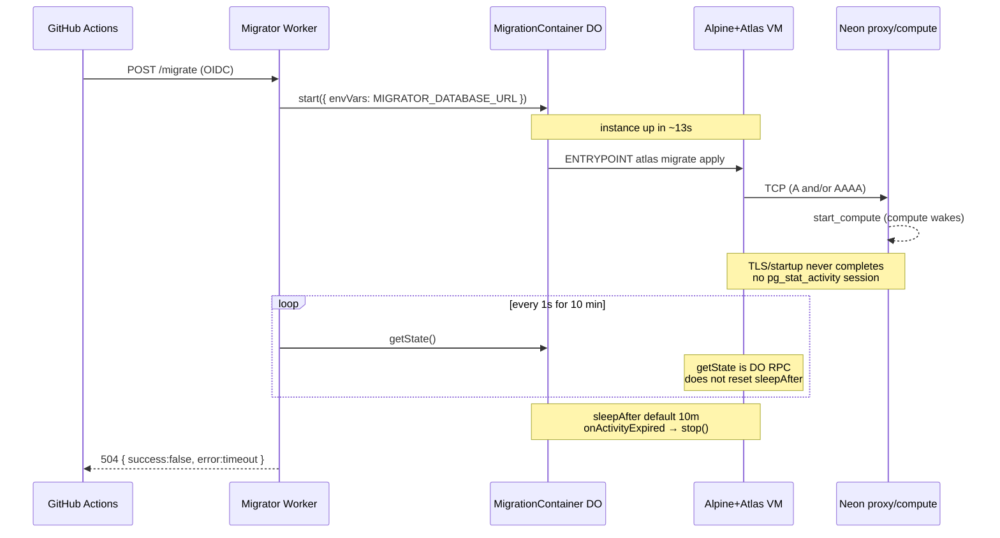
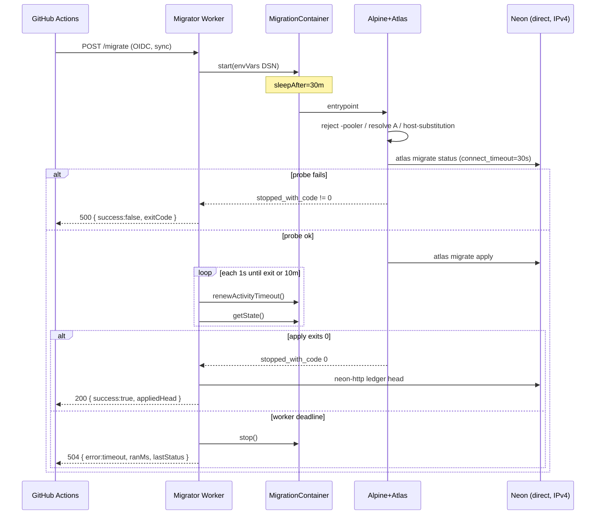
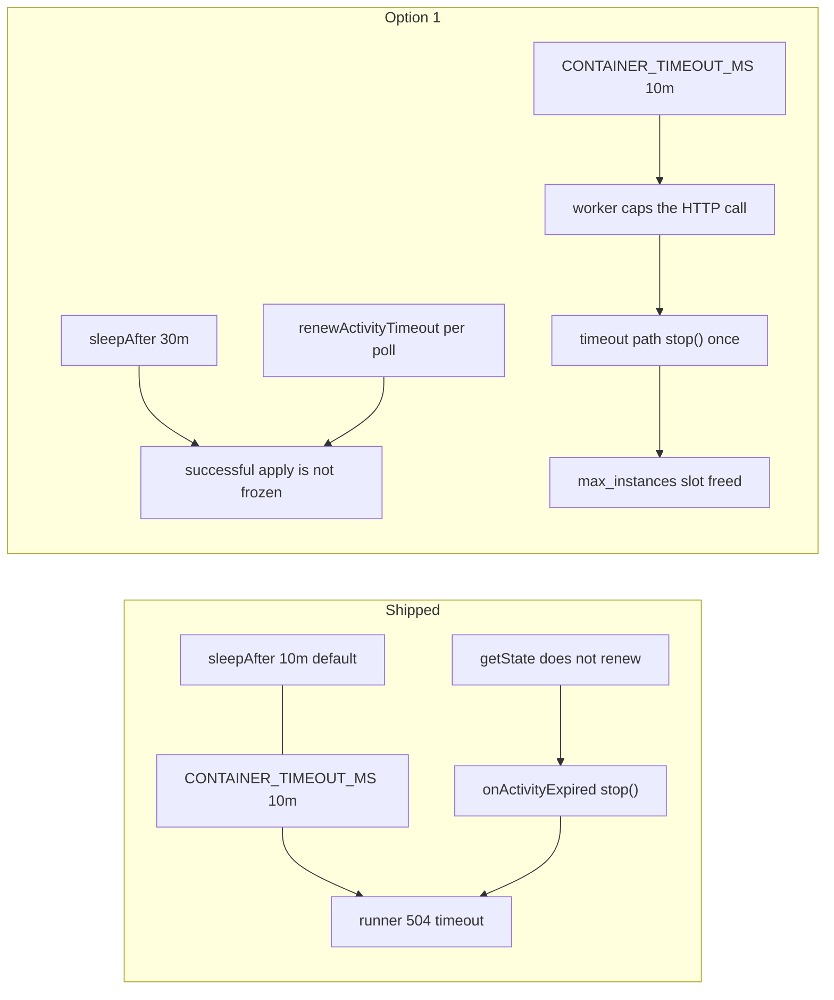
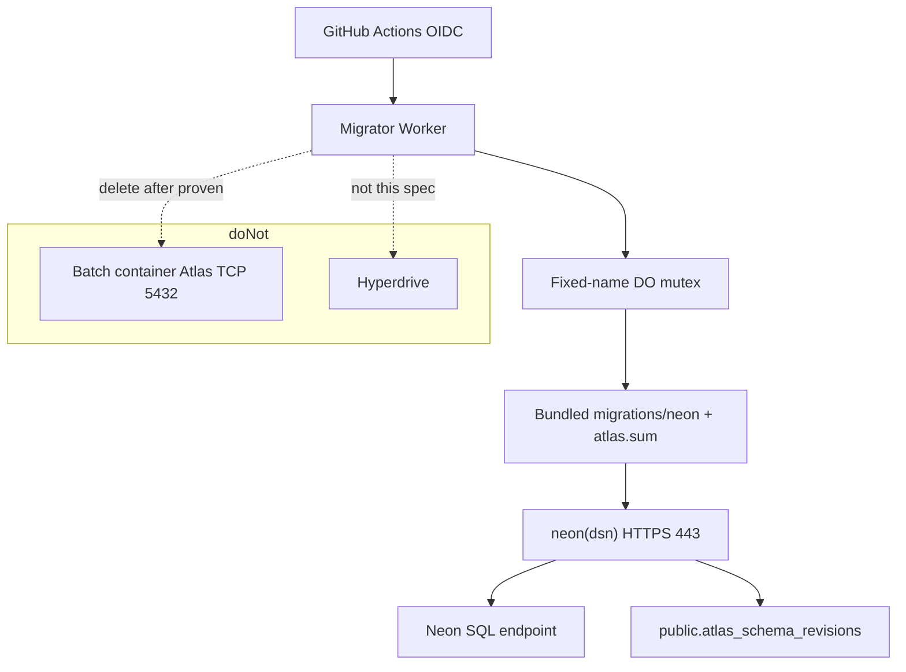

# Migrator Container → Neon Connectivity

容器连不上 Neon：IPv4 / fail-fast / 超时停容器

- Status: Draft
- Author: (design seat — Policy C; implementation later via opencode)
- Date: 2026-08-16
- Tracking: patch to shipped Migration Executor (#1051) / parent spec
  `docs/specs/2026-08-16-migration-executor-spec.md` (#1046). This document
  does **not** close #1046, #1051, #1052, #1055, or #1073.
- Related: GOAL `docs/specs/2026-08-16-migration-executor-goal.md` — #1051
  blocks #1052 / #1055; #1051 is also a minimum blocker for #1073 (doorbell,
  campaign #1071). This patch is only the connectivity hole that keeps
  staging `POST /migrate` from applying.
- Authoritative live code (not on `codex/issue-992-orm`):
  `.worktrees/1074-split-infra/workers/migrator/`

This is a **technical fix spec**, not a new secrets campaign and not an
async-API rewrite. Ranked options below are **locked**.

---

## Overview

Staging `POST /migrate` returns HTTP **504** `{ success: false, error: "timeout" }`
after exactly the worker's 10-minute deadline. The Worker, Durable Object,
OIDC door, Secrets Store DSN, and `/ledger-head` path all work. The one-shot
Atlas container reaches Neon far enough to wake compute (`start_compute`) and
then never opens a Postgres session. The same Atlas v0.30.0 binary, the same
DSN, and the same `migrations/neon` directory succeed from a laptop in
seconds (4 pending files, all small DDL).

The 10-minute 504 is a **mask**, not the root cause. `CONTAINER_TIMEOUT_MS`
is `"600000"` and the Container SDK default `sleepAfter` is `"10m"`. A
batch job with no inbound ports generates no inbound activity; Worker
`getState()` polls do not count. After 10 minutes the platform
`onActivityExpired` path stops the VM. Atlas never exits with a TLS error,
so the runner reports `timeout`.

This spec ships **Option 1** first: keep Atlas in the one-shot container;
fail-fast a `migrate status` probe with a short connect timeout; pin the
DSN to IPv4 via host-substitution onto the URL host field (+ `options=endpoint`); reject `-pooler` hosts; set `sleepAfter`
strictly longer than the worker deadline and renew the activity timer on
each poll so a *successful* apply is not frozen; **and `stop()` the
container when the runner decides timeout** so `max_instances = 1` does
not pin a hung VM. Stock `alpine:3.20` already ships a CA bundle; that
is not the connect experiment. **Option 2** (apply the committed chain
from the Worker over Neon serverless HTTP) is designed here but **not
implemented** until Option 1 fails a live staging trigger.

---

## Background & Motivation

### What already shipped

#1051 delivered the migrator Worker + batch container on staging (PRs
#1068–#1099). The live contract is:

1. GitHub Actions presents an OIDC bearer token (`src/policy.ts`, audience
   `animichi:github-actions:migrator`).
2. `src/create-app.ts` `POST /migrate` resolves `MIGRATOR_DATABASE_URL` from
   Secrets Store, starts a per-run container (`migrator-job-${nowMs}`, #1098),
   waits, then reads `public.atlas_schema_revisions` via
   `NeonMigrationsLedger` (`@neondatabase/serverless` `neon(dsn)` over HTTPS).
3. The image (`workers/migrator/Dockerfile`) is Alpine 3.20 + pinned
   `atlas-community-linux-amd64-v0.30.0` + `COPY migrations/neon`.
   `USER atlas`. `ENTRYPOINT /entrypoint.sh`. Stock `alpine:3.20`
   already includes `ca-certificates-bundle` and
   `/etc/ssl/certs/ca-certificates.crt`; the Dockerfile does not
   `apk add ca-certificates` (that package is only the
   `update-ca-certificates` *scripts*).
4. `docker/entrypoint.sh` requires `MIGRATOR_DATABASE_URL`, appends
   `search_path=public`, and runs `atlas migrate apply --dir file:///migrations
   --url "$SCOPE" --revisions-schema public` with **no connect timeout and no
   status probe**.
5. `MigrationContainer` (`src/container.ts`) sets `enableInternet = true` and
   does **not** override `sleepAfter` (SDK default `"10m"`).
6. `CloudflareContainerRunner` (`src/runner.ts`) uses
   `DEFAULT_CONTAINER_TIMEOUT_MS = 5 * 60 * 1000`, but `wrangler.toml` sets
   `CONTAINER_TIMEOUT_MS = "600000"` (10 min). `START_RPC_TIMEOUT_MS = 90s`.
   `stub.start({ envVars: { MIGRATOR_DATABASE_URL } })` — no extra start
   options. Polls `getState()` every 1s. On deadline returns
   `{ kind: "timeout" }` and **does not** `stop()` / `destroy()` the
   VM. `create-app.ts` maps that to HTTP 504
   `{ success: false, error: "timeout" }`. `max_instances = 1`.

`/healthz` and `/ledger-head` already return 200 on live staging.
`/ledger-head` is the same neon-http read the catalog uses
(`.worktrees/1074-split-infra/workers/catalog/src/db/client.ts` `makeDb()`).
**Worker → Neon HTTPS on 443 is proven.** Container → Neon Postgres on 5432
is not.

### Live staging evidence (2026-08-16, read-only)

| # | Observation | Status |
|---|---|---|
| 1 | `/healthz` 200, `/ledger-head` 200; runner polls every 1s; 10-minute deadline produces 504 `{success:false,error:timeout}` | **Fact** |
| 2 | Container instance creates in ~13s; instance API then `inactive`; no container session in Neon `pg_stat_activity`; no `atlas_migrate_execute` advisory lock | **Fact** |
| 3 | Neon ops log shows `start_compute` at container start — TCP reached Neon and woke compute — but no Postgres session was established (TLS / startup incomplete) | **Fact** |
| 4 | Same Atlas v0.30.0 + same DSN + same `migrations/neon` on a laptop: `atlas migrate status` returns in seconds. Current `20260811000001`, next `20260811000002`, 4 pending | **Fact** |
| 5 | Pending files are light DDL: `20260811000002_table_messages`, `20260811000003_table_saved_route_idempotency`, `20260812000000_catalog_daily_run` (catalog_runs + raw_payload_history + provenance), `20260814191301_turn_idempotency_outbox`. No `CREATE INDEX CONCURRENTLY` | **Fact** |
| 6 | `CONTAINER_TIMEOUT_MS` (10m) equals Container SDK `sleepAfter` default `"10m"`. Batch job has no inbound ports. `getState()` is Worker→DO RPC, not inbound container activity. Default `onActivityExpired` calls `stop()`. This **masks** a hung connect: the process never exits with a TLS error | **Fact** (mechanism) + **inference** (it is why we see 504 instead of 500) |

### Hypotheses (not proven until Option 1 runs)

These are the ranked, testable explanations that match “TCP wake, no session,
no process exit”:

1. **IPv6 black hole (primary).** Neon endpoints publish A + AAAA. If
   the container network’s IPv6 is a black hole, a Happy-Eyeballs /
   sequential AAAA SYN hangs until the OS timeout. A parallel or
   earlier IPv4 attempt can still wake compute (`start_compute`) without
   ever completing TLS/startup. The process does not exit. Atlas
   v0.30.0 `sql/postgres.ParseURL` passes `u.String()` to
   `sql.Open("postgres", dsn)`, so `hostaddr` / `connect_timeout` /
   `sslmode` / `search_path` reach the driver. Pinning `hostaddr=<ipv4>` was
   the first hypothesis, but `hostaddr` is a no-op in Atlas 0.30.0 (verified
   against the pinned binary + live staging DSN), so the experiment is the
   later-corrected host-substitution (`host=<ipv4>:5432` + `options=endpoint`).
2. **Unbounded connect + no status probe.** The entrypoint runs
   `atlas migrate apply` with no `connect_timeout` and no prior
   `migrate status`. A hung dial never becomes a non-zero exit, so the
   worker can only 504. A 30s probe is the fail-fast experiment.
3. **Platform sleep racing the worker deadline (mask, proven
   mechanism).** `sleepAfter` default `"10m"` equals
   `CONTAINER_TIMEOUT_MS`. `getState()` does not renew the timer.
   `onActivityExpired` → `stop()` hides a TLS/connect error behind a
   504. Unmasking (longer `sleepAfter` + per-poll
   `renewActivityTimeout`) is required so a *successful* apply is not
   frozen — and then the runner **must** `stop()` on timeout so the
   unmask does not lock `max_instances = 1`.

**Not a hang mechanism — empty Alpine trust store.** Stock
`alpine:3.20` (the Dockerfile base, no extra packages) already
installs `ca-certificates-bundle`; `/etc/ssl/certs/ca-certificates.crt`
exists (~218 KB, world-readable); `/etc/ssl/cert.pem` points at it.
The Dockerfile never deletes that bundle. Go `x509.SystemCertPool()`
already loads it. `apk add ca-certificates` only adds the
`update-ca-certificates` *scripts* package; it does not create a
missing store. Atlas/libpq/pgx `sslmode=require` is
encrypt-without-verify unless a verify mode is set. A missing-CA story
would also fail **fast** (`x509: … unknown authority`), not hang for
10 minutes. **Do not read a post-Option-1 504 as “we installed CAs and
it still failed.”**

Option 1 therefore changes (1) IPv4 pin, (2) fail-fast probe, (3)
activity unmask **plus stop-on-timeout** in one staging trigger.

### Why this is not a secrets or API-shape problem

`/ledger-head` already uses the migrator DSN over neon-http. The DSN value
is not the bug (laptop apply works). Putting `NEON_DATABASE_URL` back in
GitHub Actions would recreate the #1046 problem this campaign exists to
end. An async `202 + GET /tasks/:id` API, or a container→Worker heartbeat
every 15s, would change the doorbell UX or prove “can hit a Worker on
443”. Neither establishes a Postgres session. The owner rejected those as
the root-cause design.

---

## Goals & Non-Goals

### Goals

- Make container → Neon connect **fail-fast** (tens of seconds, not 10
  minutes) or **succeed** and apply the committed chain.
- Keep Atlas v0.30.0 as the chain format and `public.atlas_schema_revisions`
  as the ledger authority.
- Keep the #1046 trigger contract **synchronous** until a real apply
  (Option 1 or, if needed, Option 2) works.
- Keep the DSN out of GitHub Secrets / Actions. It stays in Cloudflare
  Secrets Store, bound only to the migrator, injected only at container
  start.
- Emit secret-free diagnostics: entrypoint lines + a richer 504 body
  (`ranMs`, last `getState().status`, `exitCode` if any).
- On worker timeout, **stop the container** so `max_instances = 1` does
  not block the parent-spec retry (`GitHub re-run of the failed job`).
- Leave a designed, not-yet-built Option 2 so a second live 504 does not
  restart design.

### Non-goals

- Heartbeat (`entrypoint` POST every 15s) as the first fix.
- Async task API (`POST /migrate` → 202 + `GET /tasks/:id`). Fine later DX,
  not this spec’s first PR. #1046 stays synchronous until connect works.
- Putting `NEON_DATABASE_URL` (or any DSN) back in GitHub Actions / Secrets.
- App-boot / Flyway in the agent container (rejected in #1039).
- Switching the chain off Atlas (Drizzle migrator, etc.; rejected in #1046).
- Merging the doorbell Worker (#1073) with the migrator.
- Hyperdrive as the container’s path to Postgres (Hyperdrive is Worker-only).
- Cloudflare outbound HTTP intercept / `interceptHttps` as the apply path
  (handlers see ports 80/443 HTTP only; 5432 is never intercepted).
- Setting `enableInternet = false` (that **denies** non-80/443 traffic).
- CI identity federation (#1071) or Pulumi Cloud.
- Production migrator path (#1055) or closing any parent issue.
- Local `wrangler deploy` (hook `block-local-deploy`).
- Expanding capability: no DROP, no arbitrary SQL, no down-migration.

---

## Key Decisions

1. **Option 1 first, one card, falsifiable.**
   Keep Atlas in the one-shot container. Fail-fast a status probe, pin
   IPv4 via host-substitution, reject pooler hosts, unmask a hung apply
   (`sleepAfter = "30m"` + `renewActivityTimeout()` per poll), and
   **`stop()` the VM when the runner hits the deadline**. Rationale:
   the hang is connect/TLS (most likely AAAA) plus a matching activity
   timer, not migration content, DSN value, Atlas version, Worker
   logic, or a missing CA bundle. That is the smallest experiment that
   can succeed *or* produce a real Atlas/TLS exit code without locking
   out the next re-run.

2. **Option 2 only if Option 1 fails a live staging trigger.**
   Do not implement Option 2 in the first PR. If a real `POST /migrate`
   still cannot open a Postgres session after Option 1, abandon
   Atlas-over-TCP-5432 inside the container and apply the committed chain
   from the Worker over neon-http (the path `ledger.ts` and catalog
   `makeDb()` already use). Rationale: HTTP/443 from this Worker is
   proven; 5432 from this image is not. Jumping to Option 2 first would
   discard Atlas’s TCP advisory lock and the already-shipped container
   without testing the cheaper fix.

3. **Heartbeat and async API are not the root-cause fix.**
   A container→Worker POST every 15s proves outbound 443 to a Worker, not
   Neon TLS. An async task API is doorbell UX after connect works. Neither
   opens a session. They may be later DX; they are not this spec’s first PR.

4. **DSN stays out of GitHub Secrets.**
   The entire #1046 campaign exists to forbid CI-held database credentials.
   Staging already injects `MIGRATOR_DATABASE_URL` from Secrets Store
   (`wrangler.toml` `[env.staging.secrets_store_secrets]`). Do not add a
   GitHub Actions fallback apply.

5. **Atlas remains the chain + ledger authority.**
   Option 1 keeps `atlas migrate apply`. Option 2, if opened, must write
   `public.atlas_schema_revisions` with the same `version` / hash semantics
   Atlas v0.30 uses so laptop `atlas migrate status` stays truthful. Do not
   switch the chain format.

6. **`enableInternet` stays `true`; do not sandbox-deny 5432.**
   Cloudflare docs: `enableInternet = false` leaves only 80, 443, and DNS;
   other ports are denied. Outbound handlers intercept HTTP/HTTPS only;
   traffic on ports other than 80 and 443 is never routed through
   `outbound`. Current code has `enableInternet = true`, so **5432 is not
   documented as blocked**. This spec does **not** claim Cloudflare
   “cannot do Postgres TCP”. It claims: HTTP is the well-trodden Worker
   path; 5432 from this image currently fails to complete TLS; Option 1
   tests IPv4 / fail-fast / activity-unmask; Option 2 leaves 5432
   entirely.

7. **Synchronous `/migrate` stays until connect actually works.**
   #1046 trigger contract: CI `curl` waits on `POST /migrate`. Do not
   change that to 202+poll in the first PR. Once Option 1 or 2 applies,
   an async API can be a later DX card.

8. **Timeout must stop the container.**
   `wrangler.toml` keeps `max_instances = 1`. Parent #1046 retry is
   “re-run the failed job”. Today `CloudflareContainerRunner` returns
   `{ kind: "timeout" }` and never calls `stop()` / `destroy()`. The
   shipped 10m/10m race at least lets `onActivityExpired` free the slot
   around the 504. Extending `sleepAfter` and renewing every poll
   *without* teardown leaves the VM counted as running for the rest of
   the 30m window; `@cloudflare/containers@0.3.7` `start()` then
   returns 503 (“no Container instance available… max concurrent
   instance count”). `sleepAfter = "30m"` + renew stay so a successful
   apply is not frozen; the timeout path must `stop()` itself.

---

## Locked Diagnosis



Proven: Worker/runner/DO are not the bug. Migration SQL is not the bug.
The DSN value and Atlas version are not the bug. The container process
does not become a Postgres client. The activity timer hides the connect
failure.

---

## Verdict (2026-08-20): the IPv4 pin **is** the bug — Option 1's own mechanism

The diagnosis above stopped one step short: it proved the container never
becomes a Postgres client, and inferred a *platform* fault. A local
bisection falsifies that inference. Same image
(`docker build --platform linux/amd64 -f workers/migrator/Dockerfile`),
same staging migrator DSN, three arms:

| Arm | What ran | Result |
|---|---|---|
| a — control | `nc -z <neon-host> 5432` inside the container | **pass** — container egress is healthy; the harness is valid |
| b — pinned | the shipped entrypoint path (`resolve_ipv4` -> `rewrite_url` host->IP + `options=endpoint`) | **fail**, 30s, `sql/migrate: read revisions: context canceled` — the production symptom, reproduced off-platform |
| c — un-pinned | same image, domain DSN, `atlas migrate status --revisions-schema public` | **pass**, 29s, ledger read (head `20260811000001`, 51 executed / 4 pending) |

**Mechanism.** With `host` rewritten to a literal IP, the TLS ClientHello
carries no SNI (RFC 6066 forbids an IP there), so Neon's SNI-routed proxy
cannot select the endpoint; `options=endpoint=<id>` does not compensate
under Atlas 0.30's pg driver. Arm (c) proves the rest of the stack is
innocent: Alpine/musl, the Go TLS stack, and the pinned Atlas binary all
connect normally over the domain. **No base-image change is required.**

**Consequences for this spec.**

- The "Option 1 falsification" section is superseded. What the live
  staging 504 falsified was **the pin**, not the container path. Option
  1's other two parts (fail-fast probe, stop-on-timeout) are sound and stay.
- **Option 2 (worker-side `neon-http` apply) is demoted to a contingency.**
  It is not opened on the strength of the 2026-08-16 trigger failure.
- The fix is subtractive: drop the resolve/rewrite block from
  `docker/entrypoint.sh` (keep the `-pooler` reject, the probe,
  `search_path=public`), paired with the runner change below —
  connectivity alone is not sufficient.

**The second, independent failure (still true).** CF batch containers
never deliver an exit-code event; the live 504 body carried
`lastStatus: "stopped"` with no `exitCode`. `runner.ts` only treats
`stopped_with_code` as terminal, so **even a successful apply cannot be
observed** — the success path is unreachable regardless of TLS. The
repair card therefore also makes bare `stopped` terminal and adopts the
**ledger head vs expected head** comparison as the success criterion.

**Expected-head contract (landed in PR #1109, branch `fix/migrator-depin`;
this document does not change code).** `POST /migrate` parses
`expectedHead` from the JSON body (`create-app.ts`) and passes it to
`runMigration`. Bare `stopped` is `unknown_exit` and is judged against
the ledger; it is not success by default. Pending vs extra revisions are
not separate HTTP outcomes — they collapse into applied-head equality
(an extra applied revision that changes the newest basename mismatches;
unapplied pending files do not change the head).

**Three `null`-looking states — keep them distinct** (2026-08-21
CodeRabbit re-review; docs-only in this PR). A missing / illegal
`expectedHead`, a legal empty ledger, and a pre-run read failure are
not the same `null`. Collapsing them is how a no-op run can be marked
`verified`.

| State | What it is | Contract |
|---|---|---|
| ① `expectedHead` missing or non-string | Caller sent no usable expected head. Landed: `expectedHeadOf` returns `undefined`; `judgeUnknownExit` mismatches when `expectedHead === undefined` **without** comparing it to `postHead: null`. | Fail immediately (`head_mismatch`, expected recorded as `null`). Absence does **not** skip the check. This is **not** a ledger-head `null`. |
| ② Ledger empty, or the revisions table does not exist | Legal first-apply pre-state. `preHead` is genuinely `null`. | Legal `null` pre-state; the container still starts. Advancement `null → X` is a real apply. |
| ③ Pre-run ledger read failed (transient I/O) | Observation failed; the actual head may already be `X`. | Must **not** treat this as "ledger advanced". Conservative conclusion: `unverified` — do not award `verified` on a `null→X` comparison whose `null` is an I/O miss. |

**Landed vs contract on ② vs ③.** PR #1109 already implements ①
correctly. The pre-run snapshot still swallows any exception and
returns `null`, so ② and ③ are not distinguishable in code. If the
ledger was already at head `X`, a transient pre-read failure
(`preHead=null`) plus a no-op run (`postHead=X=expected`) is scored
as "ledger advanced" → false `verified`. That is the mirror of the
masked-success defect this campaign already fixed (bad container
counted as success; here, a no-op counted as verified).
**Implementation-side split is an independent follow-up after PR
#1109; this document does not change code.**

| Condition | Worker conclusion (landed) |
|---|---|
| `expectedHead` absent or non-string on `unknown_exit` | `head_mismatch` (expected recorded as `null`) → HTTP **500**. Absence does **not** skip the check. Distinct from a ledger-head `null` (state ①) |
| `unknown_exit` and post-run applied head ≠ expected | `head_mismatch` → HTTP **500**, body carries both heads |
| post-run ledger read throws | not swallowed; HTTP **500** `{ success:false, error }` |
| pre-run ledger snapshot: empty ledger / missing revisions table | treated as `null` (legal pre-state, state ②); the container still starts |
| pre-run ledger snapshot throws for any other reason (transient read failure) | **landed: also treated as `null`** (collapsed with ②). Contract (state ③): must not assert advancement from that `null`; conservative `unverified`. Follow-up after PR #1109, not this PR |
| `unknown_exit`, post-head == expected, ledger **advanced** (`preHead` ≠ `postHead`) | success, `pathVerification: "verified"`. Landed advancement is `preHead !== postHead`. Because ②/③ still collapse, a swallowed pre-read (`preHead=null`) plus a no-op (`postHead=X`) looks like advancement — that is the false-`verified` case in state ③ |
| `unknown_exit`, post-head == expected, ledger **unchanged** (no-op / already at head) | success, `pathVerification: "unverified"` — schema is at the target; this run did not prove the container. #1055's ≥3 evidence counts **verified** only |
| coded exit 0 | success + `verified`; the worker does **not** re-compare `expectedHead` here. CI still fails unless `appliedHead` equals the expected head it sent (executor spec Trigger contract) |
| coded non-zero | HTTP **500**, unchanged |

CI continues to gate on `success` / `appliedHead` only; `pathVerification`
is additive.

---

## Proposed Design

### Current runtime (as shipped)

| Piece | Path | Relevant behavior |
|---|---|---|
| Image | `workers/migrator/Dockerfile` | Alpine 3.20; ADD pinned Atlas; `USER atlas`. Base already has `ca-certificates-bundle` + `getent` (`musl-utils`) + BusyBox `timeout` / `nslookup`. No `apk add ca-certificates` (scripts package only) |
| Entrypoint | `workers/migrator/docker/entrypoint.sh` | require DSN; append `search_path=public`; `atlas migrate apply`; no probe, no timeout, no host rewrite |
| Container class | `src/container.ts` | `enableInternet = true`; no `sleepAfter` |
| Runner | `src/runner.ts` | per-run DO name; 90s start RPC; poll 1s; `{ kind: "timeout" }`; **no** `stop()` |
| HTTP | `src/create-app.ts` | timeout → 504 `{ success:false, error:"timeout" }` |
| Ledger | `src/ledger.ts` | neon-http `SELECT version … ORDER BY version DESC LIMIT 1` |
| Orchestration | `src/migration.ts` | container then ledger; no destructive path |
| Config | `wrangler.toml` | staging Secrets Store DSN; `max_instances = 1`; `instance_type = "basic"`; `CONTAINER_TIMEOUT_MS = "600000"` |

### Option 1 — preferred, first PR wave

Keep Atlas in the one-shot container. Make connect fail-fast. Unmask a
hung apply without freezing a *successful* one. **Stop the VM on
timeout** so the next GitHub re-run can start an instance.

#### 1. CA bundle — optional hygiene, not the experiment

Stock `alpine:3.20` already ships `ca-certificates-bundle` and
`/etc/ssl/certs/ca-certificates.crt`. Go `x509.SystemCertPool()`
already loads it. **Do not treat `apk add ca-certificates` as a
connectivity fix** and do not rank a post-deploy 504 as “CA install
failed.”

`apk add --no-cache ca-certificates` (the *scripts* package,
`update-ca-certificates`) is **optional image hygiene** only if a later
change needs to inject extra CAs (it is not required for Option 1 and
has no AC). If added, it stays in the Dockerfile as root, before
`USER atlas`. Do not install CAs in the entrypoint. Non-root stays.

The Option 1 payload is §§2–4 plus stop-on-timeout, not this section.

#### 2. Fail-fast probe (entrypoint, before apply)

Before `atlas migrate apply`, run `atlas migrate status` against the same
directory, URL, and `--revisions-schema public`, with a **30s connect
timeout** (owner sign-off 2026-08-16; see Open Questions item 3).

Mechanism (both, in this order):

1. Append `connect_timeout=<seconds>` to the libpq/pgx URL (seconds, per
   host; [Postgres `connect_timeout`](https://www.postgresql.org/docs/current/libpq-connect.html)).
   This bounds the driver. It is **not** a statement timeout; apply DDL
   may run longer than 30s after the session exists.
2. If `/usr/bin/timeout` (BusyBox) exists, wrap the status command with
   `timeout $((PROBE_SECS + 5))` so a driver that ignores
   `connect_timeout` still dies.

Non-zero status (or wrapper 124) → print a secret-free reason → `exit`
with that code. The worker already maps `stopped_with_code` + non-zero to
HTTP **500** `{ success: false, exitCode, appliedHead: null }`. That is
the desired fail-fast surface. **Do not apply** if status failed.

Apply only if status succeeded. Apply uses the same rewritten URL
(IPv4 + `connect_timeout` + `search_path=public`).

#### 3. IPv4 pin (entrypoint)

Neon endpoints publish A + AAAA. If container IPv6 is a black hole, an
AAAA SYN hangs.

1. Parse the host out of the DSN **without printing the DSN**.
2. Reject a hostname containing `-pooler` (see §5) **case-insensitively**
   (lowercase-normalize the extracted host before the match) before resolving.
3. Resolve **A only**: `getent ahostsv4 "$host"` (STREAM row). If
   `getent` is missing or empty, fall back to BusyBox
   `nslookup -type=a`. Both the getent and the nslookup call are wrapped
   in the same BusyBox `timeout $((PROBE_SECS + 5))` as the probe so a
   resolver hang cannot outlive the probe bound. If IPv4 resolve fails,
   exit non-zero with `resolve: no A record` (no host, no DSN).
4. Rewrite the URL by **substituting the resolved IPv4 into the URL host
   field** (`host=<ipv4>:5432`): `hostaddr` is a no-op in Atlas 0.30.0
   Postgres's driver (empirically verified against the pinned binary + live
   staging DSN), so an IP-in-host is the only address pin that takes effect.
   Keep `/`:5432 as the port. Because the IP is now in the host field, also
   append `options=endpoint%3D<endpoint-id>` (URL-encoded `=`) where
   `<endpoint-id>` is the **first dot-segment of the original hostname**
   (e.g. `ep-broad-frost-aopp3uqq` from
   `ep-broad-frost-aopp3uqq.eu-central-1.aws.neon.tech`) — Neon requires
   this to route SNI once the hostname is gone. Keep `sslmode=require`:
   `require` does not verify the hostname, so an IP-in-host is TLS-safe.
   Do not strip any existing `sslmode`.

Do not `apk add bind-tools`. Stock `alpine:3.20` already provides
`getent` via `musl-utils` (including `ahostsv4`) and BusyBox
`nslookup` / `timeout`. Keep the nslookup fallback so a future
base-image shrink fails loudly in the probe, not as a 10-minute 504.

#### 4. `sleepAfter` / activity / stop-on-timeout

On `MigrationContainer`, set `sleepAfter` **strictly longer than**
`CONTAINER_TIMEOUT_MS`. Recommend `"30m"`. Wrangler stays at
`CONTAINER_TIMEOUT_MS = "600000"` (10 min). Do **not** raise the worker
deadline to chase the hang.

SDK docs do **not** document `"never"` for Containers. Sandbox `never` /
`keepAlive` is a different product and is buggy. Do not use it.

The runner poll loop must call `renewActivityTimeout()` on the
container handle each poll so a legitimately long apply is not frozen.
Document in `src/runner.ts` that **`getState()` alone does not reset
the activity timer** (CF: incoming **requests** reset the timer;
`getState` is DO RPC; confirmed in `@cloudflare/containers@0.3.7`
`dist/lib/container.js` — `getState()` only reads storage).
`renewActivityTimeout()` is the documented manual reset
([Container class](https://developers.cloudflare.com/containers/container-class/#renewactivitytimeout))
and already exists on `Container` as `renewActivityTimeout(): void`.
Widen `MigrationContainerHandle` and call it the same way `getState`
is called today.

**Timeout must stop the VM.** When the runner decides `timeout`, it
calls `stop()` once on the handle (SDK default SIGTERM) and then
returns the timeout outcome. Do not rely on `onActivityExpired` to
free the slot after a 504: with `sleepAfter = "30m"` and a renew on
every poll, the last renew leaves the instance counted as running for
up to another ~30m, and `max_instances = 1` makes the next
`start()` a 503. That is the Option 1 falsification path **and** the
parent-spec retry path.

- `stop()` is **required** on `MigrationContainerHandle` (not optional).
- Do not also call `destroy()` on the success path of `stop()`. Prefer
  `stop()` so Atlas can flush stderr to Dashboard Logs. If `stop()`
  rejects, `destroy()` (SIGKILL) is the fallback so the slot is freed.
- Do not hold the HTTP 504 on a long shutdown. An optional grace of
  at most 3 poll intervals (~3s) after `stop()` to observe
  `stopped` / `stopped_with_code` is allowed for log flush; tests
  drive it with fake timers (no wall-clock assert). Default is
  `stop()` then return.
- Call `stop()` only on the timeout path. A clean `stopped_with_code`
  already released the instance.

Do not override `onActivityExpired` to no-op. The FAQ is explicit: if
you override the hook and do not `stop()`/`destroy()`, the timer renews
and the hook fires again; the platform also does not guarantee unbounded
runtime (host moves still SIGTERM → 15 min → SIGKILL).

**Do not land `sleepAfter = "30m"` without the fail-fast probe (PR 1)
and this stop-on-timeout path (PR 2).** Today’s 10m/10m race is ugly
but at least frees the slot. PR 2 depends on PR 1; they merge
together before any staging trigger.

#### 5. Direct Neon host, not pooler

Neon: schema migrations must use the **direct** (non-`-pooler`) endpoint
([Choose your connection](https://neon.com/docs/connect/choose-connection.md)).
PgBouncer does not support the session features Atlas relies on
(advisory lock `atlas_migrate_execute`, transactional DDL).

Entrypoint rejects a hostname containing `-pooler` with a clear stderr
line and a non-zero exit **before** resolve/probe/apply. The Secrets
Store DSN is expected to already be direct (#1050); this is a
fail-closed guard, not a new secret.

#### 6. Logs (no secrets)

Entrypoint prints **no** DSN, no rewritten URL, no password, no userinfo.

Print, in this order:

- `probe: start`
- `resolve: family=A` (and `ignored=AAAA` if AAAA existed but was not
  used). Do not print the IPv4 unless needed for a live debug session;
  family is enough and is not a credential.
- `probe: elapsed_ms=<n> ok` or `probe: elapsed_ms=<n> fail code=<n>`
- `apply: start`
- Atlas stdout/stderr forwarded as-is. Atlas does not echo `--url` when
  we pass the URL as a CLI arg / env and we do not `echo` it.

Worker timeout JSON **must** include `ranMs`, last `getState().status`,
and `exitCode` if the state has one — still no DSN:

```json
{
  "success": false,
  "error": "timeout",
  "ranMs": 600123,
  "lastStatus": "running"
}
```

Do not add `lastHeartbeatSec`. There is no heartbeat in this design.

#### Entrypoint shape

Stay a small `sh` script (`set -eu`). Non-root user stays. Do not add
`apk` calls to the entrypoint. Extract tiny functions so each stays
within 1-10-50; a sourced `docker/dsn.sh` is acceptable if it keeps the
entrypoint short and makes the rewrite/reject paths fixture-testable.

Sketch (illustrative, not the implementation dump):

```sh
# docker/dsn.sh — no echo of $DSN / $SCOPE
host_of() { h=${1#*@}; h=${h%%/*}; h=${h%%:*}; printf '%s' "$h"; }

reject_pooler() {
  case "$(host_of "$1")" in
    *-pooler*) echo "refusing pooled Neon endpoint" >&2; return 2 ;;
  esac
}

append_q() {
  case "$1" in
    *\?*) printf '%s&%s' "$1" "$2" ;;
    *)    printf '%s?%s' "$1" "$2" ;;
  esac
}
```

`resolve_ipv4`, `rewrite_scope` (host-substitution + `options=endpoint` +
connect_timeout + search_path), `probe_status`, and `apply_chain` follow the
same rule:
no prints of the URL, ≤10 lines each.

`connect_timeout` is locked at **30** seconds (`PROBE_SECS=30`). Do
not add a runner env override in the first PRs.

#### Worker-side changes

`src/container.ts`:

```ts
export class MigrationContainer extends Container {
  enableInternet = true;
  sleepAfter = "30m";
}
```

`src/runner.ts` — widen the handle; renew on each poll; stop on timeout:

```ts
export interface MigrationContainerHandle {
  start(options: {
    envVars?: Record<string, string>;
    enableInternet?: boolean;
  }): Promise<void>;
  getState(): Promise<{ status: string; exitCode?: number }>;
  stop(): Promise<void>;
  destroy?: () => Promise<void>;
  renewActivityTimeout?: () => void | Promise<void>;
}
```

Poll loop (early-return, no extra nesting): call `renewActivityTimeout`
when defined, then `getState`, then terminal / deadline / sleep 1s.
On deadline: `await stub.stop()`, then return `{ kind: "timeout", … }`.
If `stop()` rejects and `destroy` is defined, `await stub.destroy()`
once, then still return timeout (do not throw a 500 that hides the
deadline). Record `startedAt` and last state so a timeout outcome
carries `ranMs` / `lastStatus` / `exitCode`.

`src/migration.ts` — extend the timeout variant:

```ts
export type ContainerOutcome =
  | { kind: "success"; exitCode: 0 }
  | { kind: "failure"; exitCode: number }
  | {
      kind: "timeout";
      ranMs: number;
      lastStatus: string;
      exitCode?: number;
    };
```

`src/create-app.ts` `outcomeResponse`: pass the timeout fields through;
never include the DSN (it is not on the outcome type).

`stub.start` still passes only `{ envVars: { MIGRATOR_DATABASE_URL } }`.
Do not set `enableInternet: false` in start options.

Do not change OIDC, Secrets Store, `max_instances`, `instance_type`,
`START_RPC_TIMEOUT_MS`, or the per-run DO name.

#### Option 1 sequence



#### Activity timer vs worker deadline



### Option 1 falsification

After Option 1 is deployed to `migrator-staging` and CI (or the owner)
triggers a real `POST /migrate`:

| Result | Meaning | Next |
|---|---|---|
| 200 + `appliedHead` equals expected (or a clean no-op at head) in well under 10 min | Connect works. Option 1 done. #1052 / #1055 evidence clock can start | Do not open Option 2 |
| 500 + `exitCode` in ~probe window; Dashboard logs show TLS / DNS / auth | Connect failed **loudly**. Fix the specific error (still Option 1, or a one-line follow-up) | Do not open Option 2 until the error is understood |
| 504 after 10 min; Neon still `start_compute` + no session; no Atlas TLS error in logs | Option 1 **failed** as a connect fix | Open Option 2. Do not add heartbeat/async as the next root-cause card |

Owner should still paste Dashboard container Logs (application
`migrator-staging-migrationcontainer-staging`) as HITL. Option 1
**proceeds without waiting** — logs may be empty if the process never
got past TLS. HITL is not a substitute for Option 1.

### Option 2 — fallback only (do not implement in the first PR)

If Option 1 ships and a real `POST /migrate` still cannot complete a
Postgres session, abandon Atlas-over-TCP-5432 inside the container.
Apply the committed chain **from the Worker** over Neon serverless HTTP
(`@neondatabase/serverless`), the path `src/ledger.ts` and catalog
`makeDb()` already use.



Requirements if Option 2 is opened:

1. **Bundle `migrations/neon` into the Worker** (Wrangler assets or
   compile-time text modules). The Worker today does **not** ship the SQL
   files; only the container image `COPY`s them.
2. **Remain Atlas-ledger compatible.** Write
   `public.atlas_schema_revisions` with Atlas v0.30 semantics so local
   `atlas migrate status` stays truthful:
   - `version` = migration basename without `.sql` (what
     `NeonMigrationsLedger` already `ORDER BY version DESC`s).
   - `hash` = the `h1:…` digest from `migrations/neon/atlas.sum` for
     that file (not a homegrown checksum).
   - `description`, `type`, `applied`, `total`, `executed_at`,
     `execution_time`, `operator_version` filled to the v0.30 shape
     (operator_version may be a documented `animichi-http-apply/0.30.0`
     marker so a human can see which path wrote the row).
   - Partial-failure rows must set `error` / `error_stmt` the way Atlas
     does, then stop. Do not mark a failed file applied.
3. **Serialize applies.** Atlas’s `atlas_migrate_execute` lock is
   TCP-session-only. neon-http is request-scoped; `pg_advisory_lock`
   will not hold across fetches. Use a **fixed-name** Durable Object
   mutex (not `migrator-job-${nowMs}` — those are one-shot and cannot
   serialize). Per-run DOs can remain for diagnostics if useful; the
   lock object is separate.
4. **Capability boundary unchanged.** Apply committed files only; no
   DROP path; no arbitrary SQL endpoint; no down-migration. The Worker
   reads files from the bundled directory, not from the request body.
5. **Direct connection string** with the serverless driver (HTTP to the
   Neon SQL endpoint on 443). Hyperdrive is **Worker-only** and is
   **not** a container fix; do not introduce it here. Reject `-pooler`
   hostnames in the Worker the same way Option 1 rejects them in the
   entrypoint.
6. **Container image.** Keep it only if something else still needs it.
   After Option 2 is proven on staging, **delete** the batch container
   from the migrator (`[[containers]]`, `MigrationContainer`, Dockerfile,
   entrypoint). Do not keep a dead container “just in case”.
7. **Multi-statement / dollar-quote / tx-mode.** Each Atlas file is one
   apply unit. neon-http supports non-interactive
   `sql.transaction([...])`. Files that require
   `CREATE INDEX CONCURRENTLY` (Atlas `txmode none`) must be called out
   and applied outside a transaction. Current pending files are light
   DDL (messages, saved_route_idempotency, catalog_runs +
   raw_payload_history + provenance, turn_outbox_events) — none use
   `CONCURRENTLY`. A later file that does must be flagged in the Option 2
   implementation card, not silently wrapped in `transaction()`.
8. **Tests (when opened).** HTTP-seam apply of a fixture chain against a
   fake `neon()` / recorded SQL; hash + ledger write assertions;
   isolation test (`workers/edge/test/migrator-role-isolation.test.ts`)
   still forbids runtime workers from binding the migrator DSN.

Option 2 does **not** put a DSN in GitHub, does not merge the doorbell,
and does not change OIDC.

---

## API / Interface Changes

OIDC, URL paths, and the success body stay as shipped.

### `POST /migrate` — timeout body (Option 1)

Before (shipped):

```json
{ "success": false, "error": "timeout" }
```

After:

```json
{
  "success": false,
  "error": "timeout",
  "ranMs": 600123,
  "lastStatus": "running"
}
```

`exitCode` is included only when `getState()` supplied one. HTTP status
stays **504**. CI that only checks `success` / HTTP status does not
break; anything that deep-equals the old body must be updated in the
same PR (`test/migrate.worker.container.test.ts`).

### `POST /migrate` — fail-fast connect (Option 1)

Unchanged 500 shape, now reachable in ~30s when the probe fails:

```json
{ "success": false, "exitCode": 1, "appliedHead": null }
```

### `POST /migrate` — success

Unchanged:

```json
{ "success": true, "exitCode": 0, "appliedHead": "<version or null>" }
```

### `GET /healthz`, `GET /ledger-head`

Unchanged. `/ledger-head` remains the Worker→Neon HTTPS canary.

### Option 2

No public API change. Same synchronous `POST /migrate`. Internally
`runContainer` is replaced (or bypassed) by an HTTP apply seam. Do not
introduce `/tasks/:id` here.

### Handle seam

`MigrationContainerHandle` gains required `stop()` and optional
`renewActivityTimeout` / `destroy`. Tests use a fake handle;
production stub is the Container DO. The timeout path must invoke
`stop` even if `renewActivityTimeout` is absent.

---

## Data Model Changes

**Option 1: none.** No migration, no new table, no change to
`public.atlas_schema_revisions`. Atlas continues to write the ledger
over TCP.

**Option 2 (if opened): no new tables.** The Worker writes the existing
Atlas v0.30 revisions relation. No Atlas SQL file is added for the
apply path itself. Hash source is the committed `atlas.sum`.

---

## Alternatives Considered

### A. Container → Worker heartbeat every 15s (rejected as root-cause)

Entrypoint `POST /internal/heartbeat`. Proves the container can open
HTTPS to a Worker. Does not prove Neon TLS. If heartbeat arrives we
have still not applied; if it does not, we file a CF ticket without a
session. Rejected as the first card. May be later DX / platform
evidence, not this spec.

### B. Async task API (rejected as root-cause)

`POST /migrate` → 202 `{ taskId }` + `GET /tasks/:id`. Per-run DOs are
a natural task record. This is reasonable doorbell UX **after** connect
works (CI already waits 900s). It does not establish a session. #1046
stays synchronous until Option 1 or 2 applies.

### C. Jump straight to Option 2 (rejected as first move)

Worker HTTP apply is the proven transport. It also throws away Atlas’s
TCP lock, requires bundling SQL + compatible ledger writes, and deletes
the just-shipped container. Owner ranking: try IPv4 pin + fail-fast
probe + activity unmask (with stop-on-timeout) first; Option 2 is the
fallback when that is falsified.

### D. `enableInternet = false` + outbound handler / `interceptHttps`

Handlers intercept HTTP/HTTPS only. 5432 never enters `outbound`.
`enableInternet = false` **denies** 5432. Setting this would make
Option 1 impossible. Rejected.

### E. Hyperdrive

Worker-only connection pool. Not available inside the container. Not a
container fix. Out of scope even for Option 2 (neon-http is enough and
already in-tree).

### F. Put the DSN back in GitHub Actions and `atlas migrate apply` on the runner

Works (laptop proof). Recreates the #1046 problem. Forbidden.

### G. App-boot Atlas / Flyway in the agent container

Rejected in #1039. Unchanged.

### H. Replace Atlas with Drizzle-kit migrate

Rejected in #1046. Option 2 keeps Atlas files + ledger, not Drizzle as
the migrator.

---

## Security & Privacy Considerations

| Topic | Rule |
|---|---|
| DSN | Secrets Store only. Injected at `start()` as `MIGRATOR_DATABASE_URL`. Not in GitHub Secrets, not in wrangler vars, not in logs, not in 504 JSON |
| Isolation | `workers/edge/test/migrator-role-isolation.test.ts` remains the machine check: no runtime worker binds `MIGRATOR_DATABASE_URL` |
| Capability | Apply committed chain only. Entrypoint / Option 2 Worker have no DROP, no ad-hoc SQL, no down-migration |
| Pooler | Reject `-pooler` so a mistaken DSN cannot silently run DDL through PgBouncer |
| Log redaction | Entrypoint never prints `$DSN` / `$SCOPE`. Atlas is not passed a URL via a line we `echo`. Worker errors use `Error.message` only (`#1091`) — keep that, and never interpolate the DSN into a message |
| OIDC | Unchanged allowlist (`src/policy.ts`). This patch does not widen the door |
| Image | `USER atlas` stays. No extra packages required for Option 1. Optional `ca-certificates` *scripts* stay root-at-build only if ever added |
| IPv4 in logs | Prefer family only. An A record of a Neon endpoint is not a password; still omit it by default |
| Option 2 | Same DSN, same role, same isolation test. Mutex DO must not expose a public HTTP unlock |

Threat model is unchanged from #1046: a stolen OIDC token is a doorbell
that can apply the committed chain, not a shell.

---

## Observability

| Signal | Where | What we need |
|---|---|---|
| Worker request | existing `[observability] enabled = true` | `/migrate` status, 500 vs 504, `ranMs` |
| Container application logs | Dashboard → `migrator-staging-migrationcontainer-staging` | Option 1 probe/resolve/apply lines; Atlas stderr |
| Neon ops | Neon console (read-only) | `start_compute` vs a real session in `pg_stat_activity` |
| Ledger | `GET /ledger-head` | applied head after a 200 |
| Activity | runner logs (no new product) | last `getState().status` on timeout |

Do not add a new Logfire dashboard or a custom metric pipeline for this
patch. Do not treat HITL log paste as a substitute for Option 1.

Alerting: the existing CI job already fails on non-200 `/migrate`. After
Option 1, a 500 in ~30s is a **louder** page than a 10-minute 504; keep
that. No new pager.

---

## Rollout Plan

Policy C: this spec is design only. Implementation is a later opencode
pass against `.worktrees/1074-split-infra/workers/migrator/` (or a fresh
worktree off `main`). No local deploy.

1. Land PR 1 (entrypoint fail-fast + IPv4) then PR 2 (activity +
   stop-on-timeout + 504 body) on `main`. PR 2 depends on PR 1; do
   not merge or deploy `sleepAfter = "30m"` without fail-fast **and**
   `stop()` on timeout. Staging deploy is the existing migrator CI
   path. A live trigger happens only after both are on `main`.
2. Do **not** wait for Dashboard logs before merging Option 1.
3. Trigger a real staging `POST /migrate` (normal pipeline, or a
   re-run of the migrate job). Record: HTTP status, body, elapsed,
   `/ledger-head`, Neon session presence.
4. Apply the falsification table above.
5. If Option 1 succeeds, stop. #1052 / #1055 consume the evidence
   (≥3 real staging applies before production). This spec does not
   open those cards.
6. If Option 1 is falsified, open Option 2 as a new card under #1046.
   Do not silently start it inside the Option 1 PRs.

**Feature flags:** none. The migrator *is* the path.

**Rollback:** revert the migrator Worker + image on staging. Old image
restores the 10-minute 504. Runtime services are untouched (they never
took a schema change). Secrets Store DSN is unchanged.

**Production:** no `[env.production]` in `wrangler.toml`. #1055 stays
blocked on staging evidence.

---

## Risks

| Risk | Severity | Mitigation |
|---|---|---|
| Hung VM occupies `max_instances = 1`; GitHub re-run `start()` 503s | High | Timeout path calls `stop()` once (then `destroy` if `stop` rejects). Unit AC: stop invoked; a subsequent fake `start` is not blocked. Do not ship `sleepAfter = "30m"` without this |
| Misreading a post-Option-1 504 as “CA install failed” | Medium | Stock `alpine:3.20` already has the bundle. CA is not the experiment. Falsification table sends us to Option 2, not another `apk add` |
| `getent ahostsv4` disappears on a future base image | Low | nslookup fallback; do not add `bind-tools` unless both fail in CI. Stock 3.20 already has `getent` via `musl-utils` |
| `connect_timeout` ignored by Atlas’s driver | Medium | BusyBox `timeout` wrapper on the **status** probe only |
| `renewActivityTimeout` not RPC-visible on the stub | Medium | Optional method on the handle; `stop()` on timeout is required regardless. `sleepAfter = "30m"` still unmasks a success-path freeze |
| IPv4 pin breaks if Neon withdraws A records | Low | Resolve failure exits non-zero with a clear message; we do not fall back to AAAA (that is the hang we are avoiding) |
| Option 1 still 504s — 5432 from this runtime cannot complete TLS | High (this is the Option 2 trigger) | Do not add heartbeat. Open Option 2. Do not claim “CF cannot do Postgres TCP” until this row is hit. `stop()` still frees the slot so Option 2 work is not wedged behind a hung VM |
| Option 2 hash/ledger drift vs Atlas v0.30 | High (if opened) | Fixture tests against `atlas.sum` + a recorded revisions row; laptop `atlas migrate status` is the acceptance check |
| Option 2 multi-statement / `CONCURRENTLY` | Medium (if opened) | Per-file apply unit; current pending files are safe; later files must declare tx-mode |
| Secrets in logs during implementation | High | Tests assert DSN substrings never appear on stdout/stderr/JSON. Reviewer treats a leaked URL as a stop |

---

## Open Questions

1. **Dashboard container Logs (HITL).** Owner still needs to paste Logs
   for application `migrator-staging-migrationcontainer-staging`. Option 1
   proceeds without waiting, because logs may be empty if the process
   never got past TLS. HITL is an operator step, not a gate and not a
   substitute for Option 1.

2. **`renewActivityTimeout` on the handle seam.**
   `@cloudflare/containers@0.3.7` already defines
   `renewActivityTimeout(): void` on `Container`. Widen
   `MigrationContainerHandle` and call it the same way `getState` is
   called. If a live stub still does not RPC it, keep
   `sleepAfter = "30m"` **and** the required `stop()`-on-timeout path
   so a 504 cannot pin `max_instances = 1`. Do not block Option 1 on
   further SDK archaeology.

3. **Exact connect-timeout seconds for the status probe.**
   **Resolved (owner, 2026-08-16): 30s.** Fail-fast versus the 10-minute
   504; cold `start_compute` still has room; 15s is too tight.

---

## References

- Parent campaign: `docs/specs/2026-08-16-migration-executor-spec.md` (#1046)
- GOAL / DAG: `docs/specs/2026-08-16-migration-executor-goal.md`
- Live migrator: `.worktrees/1074-split-infra/workers/migrator/`
  (`Dockerfile`, `docker/entrypoint.sh`, `src/container.ts`,
  `src/runner.ts`, `src/create-app.ts`, `src/ledger.ts`,
  `src/migration.ts`, `wrangler.toml`, `AGENTS.md`)
- Catalog neon-http: `.worktrees/1074-split-infra/workers/catalog/src/db/client.ts`
- Isolation contract: `.worktrees/1074-split-infra/workers/edge/test/migrator-role-isolation.test.ts`
- Neon chain: `migrations/neon/` + `docs/ops/migrations.md`
- Cloudflare outbound: <https://developers.cloudflare.com/containers/platform-details/outbound-traffic/>
- Cloudflare Container class (`sleepAfter` default `"10m"`,
  `renewActivityTimeout`, `onActivityExpired`):
  <https://developers.cloudflare.com/containers/container-class/>
- Cloudflare FAQ (no hard max runtime; class default + hook stops the
  instance): <https://developers.cloudflare.com/containers/faq/>
- Neon connection choice (Workers without Hyperdrive → serverless
  driver; schema migrations → direct, not pooler; HTTP = fetch on 443):
  <https://neon.com/docs/connect/choose-connection.md>
- Neon serverless driver: <https://neon.com/docs/serverless/serverless-driver>
- Atlas URL / SSL: <https://atlasgo.io/concepts/url>
- Docs placement: `docs/DOCS_POLICY.md` (`docs/specs/` = active specs)

---

## PR Plan

Policy C: opencode implements; this seat does not. Each PR is
independently reviewable and mergeable. Option 2 is a separate card
opened only after Option 1 is falsified on live staging.

### PR 1 — Fail-fast entrypoint + IPv4 pin

- **Title:** `fix(migrator): IPv4 pin and fail-fast Atlas probe`
- **Files / components:**
  - `workers/migrator/docker/entrypoint.sh`
  - optional `workers/migrator/docker/dsn.sh` (sourced helpers)
  - `workers/migrator/test/entrypoint.dsn.test.sh` (or equivalent
    fixture runner under `test/`)
  - `workers/migrator/Dockerfile` only if a comment or a no-op
    hygiene line is added — **not** a connectivity change
  - `workers/migrator/AGENTS.md` only if the entrypoint contract needs
    a one-line pointer (prefer not)
- **Depends on:** nothing (entrypoint only). Safe to merge alone:
  fail-fast does not extend `sleepAfter`.
- **Description:** Entrypoint rejects `-pooler` (case-insensitive), resolves A
  (getent/nslookup, timeout-bound), rewrites the URL host field to
  `<ipv4>:5432` + `options=endpoint` + `connect_timeout` + `search_path`
  without printing the DSN, runs `atlas migrate status` with a 30s
  connect bound, applies only on success. Secret-free logs. Do **not** add
  `apk add ca-certificates` as a connectivity change (stock
  `alpine:3.20` already has the bundle). Optional scripts-package
  install is hygiene only and has **no** AC.
- **ACs (each with a test):**
  - AC1 `integration`: fixture DSN whose host contains `-pooler` (lowercase
    or UPPERCASE — the match is case-insensitive) → non-zero exit, stderr
    mentions pooled endpoint, stdout/stderr do not contain the DSN/password.
  - AC2 `integration`: IPv4 resolve failure (injected empty resolver)
    → non-zero, message `resolve: no A record`, no DSN.
  - AC3 `integration`: injected A record → rewritten URL passed to a
    fake `atlas` has `host=<ipv4>` (the resolved address substituted into
    the host field, `/`:5432) plus `options=endpoint=<id>` + `connect_timeout`
    + `search_path=public`; script stdout never contains the URL. A second
    fixture asserts the resolver (getent) is wrapped by the same BusyBox
    timeout bound as the probe.
  - AC4 `integration`: fake `atlas` status non-zero → apply is **not**
    invoked; process exits non-zero.
  - AC5 `integration`: fake `atlas` status zero → apply invoked once;
    logs include `probe: start`, `resolve: family=A`, `elapsed_ms=`,
    `apply: start`.

### PR 2 — Activity timer + stop-on-timeout + diagnostics

- **Title:** `fix(migrator): sleepAfter 30m, stop on timeout, richer 504`
- **Files / components:**
  - `workers/migrator/src/container.ts`
  - `workers/migrator/src/runner.ts`
  - `workers/migrator/src/migration.ts`
  - `workers/migrator/src/create-app.ts`
  - `workers/migrator/test/runner.test.ts`
  - `workers/migrator/test/migrate.worker.container.test.ts`
  - `workers/migrator/test/migrate.worker.helpers.ts` (timeout fixture
    type only)
- **Depends on:** PR 1. Do not merge or deploy this PR without PR 1.
  `sleepAfter = "30m"` without fail-fast **and** without
  stop-on-timeout is a regression (`max_instances = 1` lockout). A
  staging trigger happens only after both PRs are on `main`.
- **Description:** Set `MigrationContainer.sleepAfter = "30m"` (strictly
  greater than `CONTAINER_TIMEOUT_MS` 10m). Widen
  `MigrationContainerHandle` with required `stop()` and optional
  `renewActivityTimeout` / `destroy`. Call `renewActivityTimeout` every
  poll so a successful apply is not frozen. On timeout, call `stop()`
  once (then `destroy` if `stop` rejects) so the instance slot is
  freed. Timeout outcomes carry `ranMs`, `lastStatus`, optional
  `exitCode`. 504 JSON matches. `enableInternet` stays `true`.
  `getState()` documented as not resetting the activity timer.
- **ACs (each with a test):**
  - AC1 `unit`: `MigrationContainer` source (or exported constant)
    asserts `sleepAfter === "30m"` and `enableInternet === true`.
  - AC2 `unit`: fake handle with `renewActivityTimeout` — runner
    invokes it at least once per poll before deadline (scripted
    `getState` + fake timers; no wall-clock assert).
  - AC3 `unit`: fake handle without `renewActivityTimeout` — runner
    still reaches `{ kind: "timeout", ranMs, lastStatus }` (does not
    throw) and still calls `stop()`.
  - AC4 `unit`: timeout outcome includes `ranMs` (number),
    `lastStatus` from the last `getState()`, and `exitCode` when the
    state has one.
  - AC5 `unit`: HTTP seam `POST /migrate` with `runContainer → timeout`
    returns 504 whose JSON has `error: "timeout"`, `ranMs`,
    `lastStatus`, and does not contain `postgresql://` or the fixture
    DSN.
  - AC6 `unit`: timeout path invokes `stop` exactly once; the fake
    namespace treats an un-stopped instance as occupying the only
    slot (`max_instances = 1`); a subsequent `start` after that
    timeout is not blocked.

### PR 3 — Option 2 Worker HTTP apply (gated; do not open with PR 1/2)

- **Title:** `feat(migrator): apply Atlas chain over neon-http (Option 2)`
- **Files / components:**
  - new `workers/migrator/src/http-apply.ts` (or similar) — bundle
    reader + per-file apply + revisions write
  - `workers/migrator/src/migration.ts` / `src/create-app.ts` — swap
    the container runner for the HTTP apply seam after the mutex
  - fixed-name lock DO (not `migrator-job-*`)
  - Wrangler assets / module rules for `migrations/neon/**` +
    `atlas.sum`
  - `workers/migrator/wrangler.toml` — drop `[[containers]]` only
    **after** staging proof (same PR or an immediately following
    delete PR)
  - `workers/migrator/test/http-apply.test.ts`
  - existing `workers/edge/test/migrator-role-isolation.test.ts`
    (must stay green)
- **Depends on:** PR 1 + PR 2 merged and a live staging `POST /migrate`
  that still cannot open a Postgres session (falsification table).
  Owner sign-off to open the card.
- **Description:** Apply committed Atlas files from the Worker over
  `@neondatabase/serverless` HTTP (direct DSN, reject `-pooler`). Write
  `public.atlas_schema_revisions` with v0.30 `version` / `h1` hash
  semantics. Serialize with a Durable Object mutex. No DROP / no
  arbitrary SQL / no down-migration. Delete the batch container once
  proven. Hyperdrive is not introduced. Synchronous `/migrate` stays.
- **ACs (each with a test):**
  - AC1 `unit`: fixture chain against a fake `neon()` records one
    transaction (or one unit) per file, in `atlas.sum` order, skipping
    already-applied versions.
  - AC2 `unit`: ledger insert uses the fixture file’s `atlas.sum` `h1`
    hash and the basename `version`; a subsequent `readAppliedHead`
    returns that version.
  - AC3 `unit`: `-pooler` DSN is rejected before any SQL.
  - AC4 `unit`: a second concurrent `run` waits on the mutex (fake
    lock; no wall clock) and does not double-apply.
  - AC5 `unit`: no code path accepts raw SQL or a down-migration from
    the request body (HTTP seam still only OIDC + empty/object body).
  - AC6 `unit`: `migrator-role-isolation` still forbids runtime
    workers from binding `MIGRATOR_DATABASE_URL`.

No further PRs are in this spec. Heartbeat, async task API, #1071, and
#1055 are other documents.
