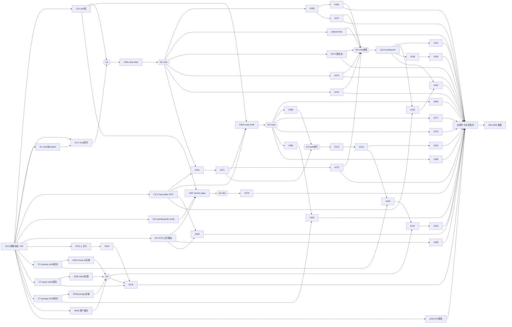

# Frontend-First Campaign — 全 backlog 前端半身攻坚计划

日期：2026-07-18 ｜ 版本：**v5（owner 签核·全栈化修订）** ｜ 状态：**SIGNED-OFF 2026-07-18**
签核记录：① 全栈做——不拆前后端半身，E1/E2 及全部后端半身入役 ② coverage 底线 90%（owner 豁免"只升不降"：现 100% 系排除 routes 的虚数，改为分母含 routes 的 90% 真实底线）③ #258/#271/#274 连后端一起做 ④ #245 sprite 用 AI 生成试作
基线分支：`feat/frontend-rebuild`（所有卡的 base 与 PR 目标，**不是 main**）
评审记录：v1 经 Fable reviewer（10 P1/8 P2）+ Codex（6 P0/6 P1/2 P2）双评审 request_changes，本版为回修稿。

## 0. 目标与策略

把清单内的卡**全栈做完**（owner 签核：不拆前后端半身）。契约先行原则保留：契约落定 → UI（MSW）与后端实现**并行**推进 → 止损门处 live 集成对拍。原则：

1. **契约唯一真源**：`packages/contract`（zod + oRPC）。catalog（8 procedures）与 users（listRoutes/saveRoute）后端已 1:1 实现，带 parity guard + OpenAPI drift guard。
2. **MSW = 测试隔离层，分三条泳道**（不承诺覆盖 SSR）：
   - Node `setupServer`：组件/loader 单测；
   - browser worker：客户端导航测试；
   - **SSR 集成**：MSW 覆盖不了 emitted Worker 运行时——用本地真 Worker + 真后端跑集成测试验证。
3. **契约测试的真实保证（不夸大）**：MSW handler 禁手写 JSON——request/response 都过契约 zod `parse()`，exact-shape 处用 strict schema，fixture 用 `satisfies` 编译期约束，加负例（非法 request/畸形 response/错误码）。该机制保证**被测路径**的形状一致；status/header/流序/auth 语义仍靠集成测试与既有 parity/OpenAPI drift guard。
4. **chat 流协议**：AI SDK UI message stream（pydantic-ai `VercelAIAdapter` → `useChat` v7）。契约物 = `chat-data-parts.ts`（intent-first discriminated union）+ **从真实 adapter 录制的 fixture 快照**（无服务端编译期 parity，防漂移只靠快照 + G1 真流校验）。fixture 必须过 AI SDK 解码器校验：SSE framing、`x-vercel-ai-ui-message-stream: v1` header、chunk 顺序、`[DONE]`、abort、错误 part。
5. **后端工作全部入役**（owner 签核，原"例外"概念作废）：E1、E2/#275、#243 check-in、#235 share-token、#249 R2 presign、#229 OG 管线，以及 #258 的 SLO 门禁+warm-keeping、#271 的 catalog ×1.3 系数、#274 的边缘限流+熔断。原例外说明留档：
   - **E1 chat 渐进流 enabler**（#256 一部分，Python agent）：当前 `/v1/chat` 只发 `start → start-step → 单个 data-response → finish-step → finish → done`，无 tool parts、无同 ID 渐进覆写（`chat.py` 实测）。iter-1 本就要求 spike + 后端主动推送 data parts。无此卡则真实 fixture 无从录起。
   - **E2 catalog 公开数据路由 #275**（S5.4，first public exposure）：#267/#269/#276/#288/#278 整条 discover 线的数据源。catalog worker 已存在，增量是公开只读路由 + 契约。**owner 签核点：确认这两处后端例外**。
   - walk check-in（#243）、share-token（#235）、R2 presign（#249）后端实现卡入役（CT 契约卡之后、G4 之前合并）；动态 OG（#229）入役，但 anime page 首发不被其阻塞（合并后回接 #267/#219）。**owning service 现在指定**：check-in / share-token / R2 presign 三者均归 `workers/users`（用户域数据；后续 eng-review 可改，契约注释先落此假设）。每份先行契约必须写明 auth、幂等/重放（check-in 队列）、token 过期/吊销（share）、presign 失败模式，过契约评审门（= §3 DAG 中的 CT 节点）才准进 UI。
6. **coverage 政策（owner 已签核）**：底线 **90%**、分母含 routes（取消 `src/routes/**`/`router.tsx` 全量排除，C0.1 合并时生效；W4 终局校准）。owner 2026-07-18 豁免"只升不降"一次：100%→90% 是把分母做实的等价换算，非放水；自 90% 起"只升不降"恢复生效。地图/canvas 浏览器胶水如仍需 exclude，逐文件注明理由并在 PR 中列出供否决。
7. **依赖升级**：C0.0 一次性升到 latest（**解析截止点 = C0.0 执行当日**，产物 lockfile + 版本清单记入 PR，使 C0.0 自身可追溯）并冻结；此后所有卡用冻结集，不许各自再 resolve latest；再升级走独立依赖 PR 过全量门禁。
8. **best-practice 义务（owner 2026-07-18 指令）**：动手前必查官方最佳实践（AI SDK → `ai-sdk` skill+官方文档；React/TanStack/oRPC → context7/官方文档；不确定就上网调研，禁凭训练记忆）。clean code（小函数/意图命名/无重复）+ clean architecture（依赖指向内：组件 → query hooks → oRPC client，UI 不碰传输层）。reviewer 评审项含"是否为当前官方推荐用法"。

## 1. 现状（2026-07-18 实测）

- ✅ 已合主干：S0.2 skeleton、S0.3 部署链、S0.5 DS tokens、S0.10 契约执法
- ❌ 缺口：apps/web 无 API 层（无 oRPC client/TanStack Query/MSW/QueryClient/hydration 布线）、无 i18n、Landing stub、S0.4 map spike 未做
- auth：Neon Auth 已开通 + JWKS 就绪、workers/users 已验 JWT，但 **apps/web 端 client 未集成**——C0.4 的 scope 含真实集成，不是 mock 壳
- 参照 spec：`docs/superpowers/specs/2026-07-06-frontend-rebuild/iter-0..7.md`（依赖边以 spec 为准）

## 2. 卡片清单（调度以 §3 DAG 为准，wave 仅是标签）

### 前置门 G0 — 单独先行（串行）

| 卡 | 范围 |
|---|---|
| C0.0 依赖升级 | 全 workspace 升 latest（zod/oRPC exact-pin 组联动、TanStack/React/Tailwind/vitest breaking changes 跟进），**冻结 lockfile 为战役基线**，全门禁绿后其余卡才准起跑 |

### Wave 0 — 基建（C0.0 之后并行）

| 卡 | Issue | 范围 | AC 类型 |
|---|---|---|---|
| C0.1 API 层 | — | `@orpc/client` + `@orpc/tanstack-query`(含 RPC serializer) + TanStack Query：per-request `QueryClient`（`getRouter` 内建）、router context/provider、dehydrate/hydrate 布线、catalog/users **分离的 client 工厂**（各自 base URL/key/cookie 与 auth 头转发）、SSR absolute-origin；MSW 三泳道基建；测试证明：无跨请求缓存泄漏、无 hydration 双抓、SSR 与客户端导航错误同型 | unit + integration |
| C0.2 chat 契约 | #256 部分 | `chat-data-parts.ts` + fixture 快照集（按 §0.4 全协议校验）；依赖 E1 出真流 | unit |
| E1 chat 渐进流 | #256 部分 | Python agent：data parts 主动推送（同 ID 覆写）+ tool parts 透出；录制真流存 fixture | unit + api |
| C0.3 map spike | #237 | MapLibre + pmtiles ADR + `_dev/map-spike` route | unit + browser |
| C0.4 landing/login/i18n | #246 | i18n（ja/zh/en）、Landing 迁移、LoginModal = **Neon Auth(Better Auth) client 真实集成**（禁 Supabase auth） | unit + browser |
| E2 catalog 公开路由 | #275 | 公开只读 oRPC 路由 + 契约（eng-review 签核的 first public exposure） | unit + api |

### Wave 1 — 骨架

- **W1.1 #256 chat shell**（dep C0.1, C0.2, E1）：chat 页骨架 + `useChat` 接流 + A/B 状态族
- **W1.2 #264 route detail shell**（dep C0.1, C0.3, **#271**——spec S2.1 依赖 S1.5 的 route 数据形状与 RouteCard 复用）
- **W1.3 #267 anime page**（dep C0.1, C0.4, **E2/#275**）：SSR shell + SW network-first + fact-summary + hreflang；**首发不带动态 OG**（#229 descope）

### Wave 2 — 主体（卡级 DAG，非全并行；registry/router/i18n 等共享文件改动串行化）

- **chat 链**：`#256 → #258 → #260`；`C0.3 + #256 → #261 → #271 → #273`；`#258 → #272`；`#256 → #284`（BYOK 设置面板前端）；`#256 → #274 全栈`（匿名态/配额耗尽 UI/login-wall 触发 + 边缘限流与每日预算熔断后端）
  - **#258 全栈 DoD**：前端埋点+等待仪式 + 后端 warm-keeping 配置（wrangler.toml）；首 token SLO 门禁（warm p95 ≤3s，n=20 真容器探针）由 Tester 在该泳道 G3 验收，不达标卡不关
  - **#271 全栈 DoD**：RouteCard(TimedItinerary)+Walk 入口前端 + workers/catalog ×1.3 绕行系数及其测试
- **route-detail**（dep #264）：#266、#268、#277、#279、#280、#286（users 直连）
- **discover**：#269（dep C0.3+E2）、#270（dep #256）、#276（dep #256；外部前置 #289 服务已 live，**视为已满足**）、#288（dep **#275**，非 #267）、#278 前端半身（JSON-LD 组件/sitemap/hreflang；dep #267）
- #252：**明确不做**（infra/域名），其 SEO 前端耦合已并入 #278

### Wave 3 — 外围（子波：契约/shell → 功能卡 → 离线/公开集成）

- **walk**（入口门 = **G3W**，入边为 `#271 + #268`）：`#213 → #216`；`CT-checkin(#243 契约先行) + #216 → #220`(check-in 动作+GPS 截断)；`#216 → #223`；`#220 → #241`(离线队列)`→ #225`；#245 fox sprite = **AI 生成 8 帧试作**（imagegen 管线产出供 owner 审，不满意换人工素材；不 blocked）
- **shiori**：`#212 → #215`（C0.0 后即可早启，spec S4.1 无其他依赖）；`CT-presign(#249 契约先行) + #280 → #242`；`CT-share(#235 契约先行) + #215 → #219`
- **后端实现卡（全栈化新增）**：`CT-checkin → #243`、`CT-share → #235`、`CT-presign → #249`（三者均须在 G4 前合并，UI 期间用 MSW）；`#229 OG 管线`（C0.0 后即可起，合并后回接 #267/#219，不阻塞其首发）
- **workbench**（入口门 = **G3C**：chat 泳道全部终端合并后放行；spec 依赖为 chat 组件 #256–#271，非 route shell）：`#214 → #221`；`#214 + C0.3 → #218`；`#214 + #218 → #232`；`#214 → #236 → #239`

### Wave 4 — 收尾

- #248 splash + 删 legacy `frontend/`——**触发条件 = §3 全部叶卡合并**（lead 按清单核对，不依赖图上简化入边）；coverage 终局校准（政策已于 C0.1 生效）；S0.9 剩余 docs

### 明确不做（无前端半身或已 descope）

S7 全部（#227/233/238/240/247/251/253/257/265）、#228/#250/#252/#254/#255/#259/#281/#282/#283/#285/#287/#289†/#290/#291/#292/#293/#301/#302/#303/#304/#305/#309/#312/#315/#325/#333（† = 服务已 live，仅 issue 收尾不在本战役）。#229/#235/#243/#249/#275 已随全栈化签核移入战役。

## 3. 卡级依赖 DAG（调度唯一依据）

调度规则：按 DAG 就绪即派（真前置合并即释放下游），不设全波 barrier；止损门（G0/G1 全局，G2/G3 泳道级，G4 末端子波）已编码为图中节点，调度器按图执行即自动落实。**共享热点文件（generative registry、routeTree、i18n 资源、契约包）同一时刻只允许一张在改**，契约包改动一律串行。`ALL→FIN` 表示 W4 依赖**全部**叶卡合并（图中已连入全部叶节点，lead 触发前仍按 §2 清单人工核对一遍）。G2D 只门控 #267 的真实下游（#278）；#288/#269 依赖 E2 而非 shell，不经 G2D——与"泳道级门不制造假依赖"的语义一致。泳道内部若与 iter-*.md 的细粒度依赖有出入，以 spec 为准。

## 4. 执行细则

- executor：`Agent(subagent_type="executor", model="opus", isolation="worktree")`；base/PR 目标一律 `feat/frontend-rebuild`。（**政策注记**：owner 2026-07-18 指令 Opus 4.8 写码，本战役内取代 Policy B/Codex 写码；lead 只派发/审查/review）
- 每卡 prompt 必带：TDD、契约 zod 双向 parse + strict/负例、禁 suppression、≤10 行函数、语义 token、AC 测试类型标注、best-practice 调研义务（§0.8）
- reviewer：每 PR 只读评审 + `ac_total == ac_with_test` + 官方推荐用法核查；lead 抽查测试真实性（防篡改）
- **Tester 环节**：browser/api 类 AC 不在 MSW 层结案——每个止损门（G2 起）由 Tester 对真实 app（本地 Worker + 真后端）跑验收；MSW 层只作组件级 AC 达标凭据
- **止损门（到门必停，过门才继续派卡）**：
  - **G0**：C0.0 后——lockfile 基线稳定、全门禁绿
  - **G1**：C0.1+C0.2+E1 后——一条 SSR oRPC 页 + 一条真实解码 chat 流，MSW 与 live 双通过
  - **G2（泳道级）**：每个 shell（#256/#264/#267）合并后，Tester 对该 shell 跑 hydration/auth 上下文/错误态/浏览器 smoke，通过才释放**该泳道**下游——不阻塞无关泳道（#264 因依赖 #271 天然后置，其 G2 也随之后置，不影响 chat/discover 泳道推进）
  - **G3（泳道级复测门，位置以 DAG 为准）**：放行时复测 CI 时长、coverage 分母、合并冲突率、契约 churn。两个实例：**G3C** 等 chat 泳道全部终端（#260/#272/#273/#284/#274/#270/#276）后放行 workbench；**G3W** 等 walk 的 spec 前置（#271/#268）后放行 walk 链——walk 无需全泳道收尾，因其 spec 前置即 #271/#268，提早放行不旁路任何真实依赖，复测清单照跑
  - **G4**：进入离线/公开集成子波（#241/#219）前——CT-checkin/CT-share/CT-presign 过契约评审门、离线语义验证方案就绪、#245 资产就位（只阻塞 walk/shiori 末端，见 DAG G4 节点）
  - **门与 ready-dispatch 的关系**：全局门只有 G0/G1；G2/G3 是泳道级、G4 只挂末端子波——均已画进 §3 DAG，调度器按图执行即自动落实止损，两套语义不冲突
- **自动暂停触发**（不限于两条）：消费者开工后契约形变、连续两次返工 PR、CI 超时预算、live 与 MSW 行为分歧、SSR 请求上下文/auth 泄漏疑点、任何 auth/token 安全敏感决策、服务归属不明

## 5. 风险

1. chat 流 mock 保真度：fixture 必须真录（E1 产出）+ AI SDK 解码器全协议校验；G1 用 live 流对拍。
2. 契约先行三块（check-in/share/presign）无实现方兜底：契约评审门 + 未来 owner 写死在契约注释；后端落地若改形状，契约包是唯一改点。
3. coverage：分母 ratchet 政策（§0.6）待 owner 一次性裁定，避免逐卡救火。
4. 长命 base 分支上 40+ PR 的 rebase 漂移与共享文件冲突：DAG 热点串行 + 每个止损门统一 rebase 存量分支。
5. legacy `frontend/` 删除时机：W4 才删，期间 root worker 静态路由不动。
6. Neon Auth 端到端首次打通在 C0.4：若集成受阻即触发自动暂停上报，不得静默降级为 mock 登录。

## 6. owner 签核记录（2026-07-18，见文件头）

四项裁决：全栈化（后端半身全入役）、coverage 90% 底线（豁免记录在 §0.6）、#258/#271/#274 连后端做、#245 AI 试作。战役据此自主执行，止损门与自动暂停触发照 §4。
